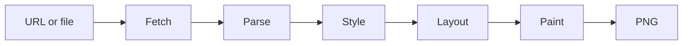

# simplebrowser

`simplebrowser` is an educational browser built from scratch in Go. Its goal is
to turn a URL or HTML file into a PNG, with enough web-platform support to
render [Hacker News](https://news.ycombinator.com/) recognizably.

The project has a working fetch, parse, cascade, and layout pipeline covering
block, inline, and table formatting. The CLI fetches HTTP(S) pages, builds a
DOM, loads CSS, and computes deterministic box geometry and wrapped text runs,
including the nested tables Hacker News uses for its page structure. Painting
still emits a deterministic placeholder image.

## Architecture



The pipeline lives in `internal/browser`. `Document.Root` is a fragment-friendly
DOM with parent/child links, text, comments, doctypes, and ordered attributes.
`Document.BaseURL` holds the effective fetched source (including redirects) for
future relative resource resolution. This is a practical tolerant HTML subset,
not a complete HTML5 parsing algorithm.

`ExtractStyles` collects author stylesheets in DOM order (using `Document.BaseURL`
for linked resources) and inline declarations by node. `UserAgentStylesheet`
provides defaults separately. CSS parsing supports common selectors, values,
and `!important`; computed styles retain CSS text for layout to convert. Layout
exposes boxes and text runs through `Layout.Root`, with configurable viewport
geometry and basic embedded Go font metrics.

Table layout uses the separated-borders model: columns are sized from intrinsic
min/max content widths plus explicit CSS and HTML widths (pixels pin a column,
percentages resolve against the table width), `colspan` widens cells across
columns, and `rowspan` cells cover their rows with any extra height added to the
last spanned row. `cellspacing` and `cellpadding` arrive through the cascade as
`border-spacing` and the table's `padding-*`, the latter acting as the default
padding of cells that declare none. Malformed tables are repaired with anonymous
rows and cells rather than dropped; `internal/browser/table.go` documents each
simplification.

## Usage

Go 1.24 or later is required.

```sh
go run ./cmd/simplebrowser -o out.png https://example.com/
```

The output is currently an 800×600 placeholder PNG while painting is developed.
HTTP(S) resources are
fetched with bounded HTTP/1.1 responses, redirects, and gzip support. Local
paths and `file://` URLs read the supplied file.

## Rendering progress

Every pull request and push to `main` renders the checked-in Hacker News
snapshot. Open the latest [CI workflow run](https://github.com/lukehoban/simplebrowser/actions/workflows/ci.yml)
and download its `hn-render-*` artifact to inspect `hn-fixture.png`. The image
is a placeholder while layout and painting are under development; keeping the
artifact stable makes progress visible as those stages land.

Render the same network-free fixture locally with:

```sh
go run ./cmd/simplebrowser -o hn-fixture.png testdata/hn/news.html
```

The HTML, stylesheet, and small image assets in `testdata/hn` are a captured
snapshot, so this command and the end-to-end test do not depend on live Hacker
News availability or content.

Run the project checks locally with:

```sh
gofmt -w .
go vet ./...
go test ./...
go test -race ./...
go build ./cmd/simplebrowser
```

## Roadmap

Work is tracked under the [browser epic (#2)](https://github.com/lukehoban/simplebrowser/issues/2):

- [Project scaffold and CI (#3)](https://github.com/lukehoban/simplebrowser/issues/3)
- [HTTP/1.1 networking over TCP/TLS (#4)](https://github.com/lukehoban/simplebrowser/issues/4) — implemented
- [HTML tokenizer, parser, and DOM (#5)](https://github.com/lukehoban/simplebrowser/issues/5) — implemented; review pending
- [CSS parser and user-agent stylesheet (#6)](https://github.com/lukehoban/simplebrowser/issues/6) — implemented; review pending
- [Selector matching, cascade, and inheritance (#7)](https://github.com/lukehoban/simplebrowser/issues/7) — implemented
- [Block and inline layout (#8)](https://github.com/lukehoban/simplebrowser/issues/8) — implemented
- [Table layout (#9)](https://github.com/lukehoban/simplebrowser/issues/9) — implemented; review pending
- [PNG painting (#10)](https://github.com/lukehoban/simplebrowser/issues/10)
- [GIF, PNG, and JPEG images (#11)](https://github.com/lukehoban/simplebrowser/issues/11)
- [Hacker News rendering fidelity and visual CI (#12)](https://github.com/lukehoban/simplebrowser/issues/12) — offline fixture and render artifact in CI; visual fidelity pending painting

See the linked issues for current status and implementation scope.
