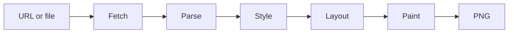

# simplebrowser

`simplebrowser` is an educational browser built from scratch in Go. Its goal is
to turn a URL or HTML file into a PNG, with enough web-platform support to
render [Hacker News](https://news.ycombinator.com/) recognizably.

The project has a working fetch, parse, cascade, and layout pipeline covering
block, inline, and table formatting. The CLI fetches HTTP(S) pages, builds a
DOM, loads CSS, and computes deterministic box geometry and wrapped text runs,
including the nested tables Hacker News uses for its page structure. Painting
now rasterizes backgrounds, borders, and embedded-font text. Images and advanced
CSS remain future work.

## Rendering progress


*Offline Hacker News snapshot rendered with the painter from
[6c78247](https://github.com/lukehoban/simplebrowser/commit/6c782479b55259df391fbd0766ce684be6fd8380)
(2026-09-26). The screenshot is a progress snapshot, not a pixel-accurate
Hacker News reference.*

Every pull request and push to `main` renders the fixture and uploads the
latest PNG as an `hn-render-*` artifact on the
[CI workflow](https://github.com/lukehoban/simplebrowser/actions/workflows/ci.yml).
CI compares the generated image against this checked-in screenshot, so
intentional rendering changes must refresh it:

```sh
make screenshot
```

The offline HTML, stylesheet, and small image assets in `testdata/hn` are a
captured snapshot; rendering does not depend on live Hacker News availability.
Links currently appear blue and underlined rather than matching HN's black
titles and gray subtext; some underlines extend through trailing whitespace.
The logo and vote arrows are missing pending [image support
(#11)](https://github.com/lukehoban/simplebrowser/issues/11).

## Architecture



The pipeline lives in `internal/browser`. `Document.Root` is a fragment-friendly
DOM with parent/child links, text, comments, doctypes, and ordered attributes.
`Document.BaseURL` holds the effective fetched source (including redirects) for
future relative resource resolution. This is a practical tolerant HTML subset,
not a complete HTML5 parsing algorithm.

`ExtractStyles` collects author stylesheets in DOM order (using `Document.BaseURL`
for linked resources) and inline declarations by node. `UserAgentStylesheet`
provides defaults separately. CSS parsing supports common selectors, values,
and `!important`; computed styles retain CSS text for layout to convert. Layout
exposes boxes and text runs through `Layout.Root`, with configurable viewport
geometry and basic embedded Go font metrics.

Table layout uses the separated-borders model: columns are sized from intrinsic
min/max content widths plus explicit CSS and HTML widths (pixels pin a column,
percentages resolve against the table width), `colspan` widens cells across
columns, and `rowspan` cells cover their rows with any extra height added to the
last spanned row. `cellspacing` and `cellpadding` arrive through the cascade as
`border-spacing` and the table's `padding-*`, the latter acting as the default
padding of cells that declare none. Malformed tables are repaired with anonymous
rows and cells rather than dropped; `internal/browser/table.go` documents each
simplification.

## Usage

Go 1.24 or later is required.

```sh
go run ./cmd/simplebrowser -o out.png https://example.com/
```

The output is currently an 800×600 PNG with viewport-clipped boxes and text.
HTTP(S) resources are
fetched with bounded HTTP/1.1 responses, redirects, and gzip support. Local
paths and `file://` URLs read the supplied file.

Run the project checks locally with:

```sh
gofmt -w .
go vet ./...
go test ./...
go test -race ./...
go build ./cmd/simplebrowser
```

## Roadmap

Work is tracked under the [browser epic (#2)](https://github.com/lukehoban/simplebrowser/issues/2):

- [Project scaffold and CI (#3)](https://github.com/lukehoban/simplebrowser/issues/3)
- [HTTP/1.1 networking over TCP/TLS (#4)](https://github.com/lukehoban/simplebrowser/issues/4) — implemented
- [HTML tokenizer, parser, and DOM (#5)](https://github.com/lukehoban/simplebrowser/issues/5) — implemented; review pending
- [CSS parser and user-agent stylesheet (#6)](https://github.com/lukehoban/simplebrowser/issues/6) — implemented; review pending
- [Selector matching, cascade, and inheritance (#7)](https://github.com/lukehoban/simplebrowser/issues/7) — implemented
- [Block and inline layout (#8)](https://github.com/lukehoban/simplebrowser/issues/8) — implemented
- [Table layout (#9)](https://github.com/lukehoban/simplebrowser/issues/9) — implemented; review pending
- [PNG painting (#10)](https://github.com/lukehoban/simplebrowser/issues/10) — backgrounds, per-side borders, embedded-font text, and clipping implemented
- [GIF, PNG, and JPEG images (#11)](https://github.com/lukehoban/simplebrowser/issues/11)
- [Hacker News rendering fidelity and visual CI (#12)](https://github.com/lukehoban/simplebrowser/issues/12) — offline fixture, checked-in screenshot, and render artifact in CI; visual fidelity in progress

See the linked issues for current status and implementation scope.
