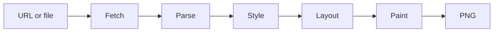

# simplebrowser

`simplebrowser` is an educational browser built from scratch in Go. Its goal is
to turn a URL or HTML file into a PNG, with enough web-platform support to
render [Hacker News](https://news.ycombinator.com/) recognizably.

The project is at the **HTML parsing stage**. The CLI fetches HTTP(S) pages and
local files, tokenizes HTML, and builds a DOM. Painting still emits a
deterministic placeholder image; CSS, layout, and page rendering are not
implemented yet.

## Architecture



The pipeline lives in `internal/browser`. `Document.Root` is a fragment-friendly
DOM with parent/child links, text, comments, doctypes, and ordered attributes.
`Document.BaseURL` holds the effective fetched source (including redirects) for
future relative resource resolution. This is a practical tolerant HTML subset,
not a complete HTML5 parsing algorithm.

## Usage

Go 1.24 or later is required.

```sh
go run ./cmd/simplebrowser -o out.png https://example.com/
```

The output is currently an 800×600 placeholder PNG. HTTP(S) resources are
fetched with bounded HTTP/1.1 responses, redirects, and gzip support. Local
paths and `file://` URLs read the supplied file.

Run the project checks locally with:

```sh
gofmt -w .
go vet ./...
go test ./...
go test -race ./...
go build ./cmd/simplebrowser
```

## Roadmap

Work is tracked under the [browser epic (#2)](https://github.com/lukehoban/simplebrowser/issues/2):

- [Project scaffold and CI (#3)](https://github.com/lukehoban/simplebrowser/issues/3)
- [HTTP/1.1 networking over TCP/TLS (#4)](https://github.com/lukehoban/simplebrowser/issues/4) — implemented
- [HTML tokenizer, parser, and DOM (#5)](https://github.com/lukehoban/simplebrowser/issues/5) — implemented; review pending
- [CSS parser and user-agent stylesheet (#6)](https://github.com/lukehoban/simplebrowser/issues/6)
- [Selector matching, cascade, and inheritance (#7)](https://github.com/lukehoban/simplebrowser/issues/7)
- [Block and inline layout (#8)](https://github.com/lukehoban/simplebrowser/issues/8)
- [Table layout (#9)](https://github.com/lukehoban/simplebrowser/issues/9)
- [PNG painting (#10)](https://github.com/lukehoban/simplebrowser/issues/10)
- [GIF, PNG, and JPEG images (#11)](https://github.com/lukehoban/simplebrowser/issues/11)
- [Hacker News rendering fidelity and visual CI (#12)](https://github.com/lukehoban/simplebrowser/issues/12)

See the linked issues for current status and implementation scope.
