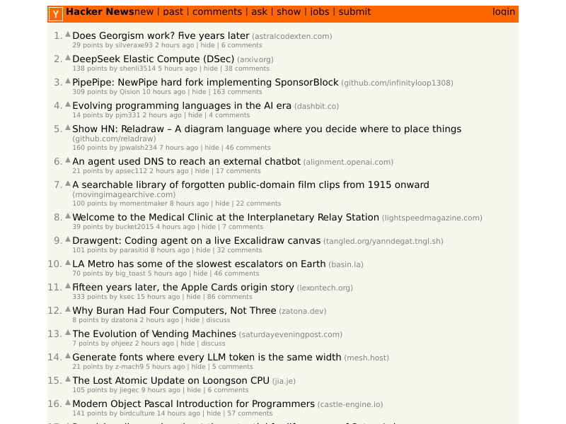
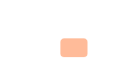
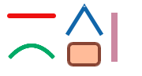
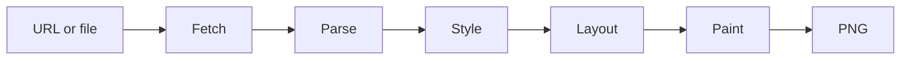
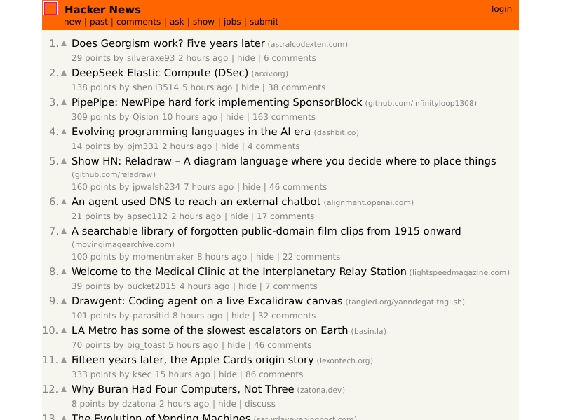

# simplebrowser

`simplebrowser` is an educational browser built from scratch in Go. Its goal is
to turn a URL or HTML file into a PNG, with enough web-platform support to
render [Hacker News](https://news.ycombinator.com/) recognizably.

The project has a working fetch, parse, cascade, and layout pipeline covering
block, inline, and table formatting. The CLI fetches HTTP(S) pages, builds a
DOM, loads CSS and GIF/PNG/JPEG images, and computes deterministic box geometry
and wrapped text runs, including replaced image boxes and the nested tables
Hacker News uses for its page structure. Explicitly sized tables honor auto
side margins and legacy centered containers, so the 85%-wide HN page is
centered in the viewport. Adjoining vertical block margins collapse (between
siblings and through parents' first/last children). Typography resolves inherited and
relative font sizes, maps common sans/serif/monospace family lists to embedded
Go fonts, and applies CSS line heights. CSS lengths support
`vw`/`vh`/`vmin`/`vmax` against the render viewport.
Inline text uses font ascents and descents
to share a baseline with replaced images (including `vertical-align: top`, `middle`,
and `bottom`). Painting rasterizes colors, CSS background images
(GIF/PNG/JPEG/SVG), borders, embedded-font text, scaled GIF/PNG/JPEG ``
elements, and neutral placeholders for unsupported `` elements, honoring
`z-index` stacking order for positioned boxes. A minimal in-repo SVG subset
(`<svg>` sizing and `viewBox`, `<g>`, `<path>`, basic shapes including `<rect>`,
`<circle>`, `<ellipse>`, `<line>`, `<polyline>`, and `<polygon>`),
solid fills and strokes, elliptical path arcs, transforms) renders at the used size for both ``
and CSS backgrounds. `<use>`/`<defs>` references and advanced CSS remain future work.

## Rendering progress



**Compatibility benchmark: [12/13 pinned WPT reftests passing](docs/compatibility.md)**
([JSON](docs/compatibility.json)). Run `make compatibility` to regenerate the
committed report and inspect failed test/reference/diff PNGs in `artifacts/wpt/`.

*Offline Hacker News snapshot generated from the repository's current source
(2026-09-26), with image painting, fixed-point line wrapping, and the SVG
logo and vote-arrow backgrounds. This is a progress snapshot, not a
pixel-accurate HN reference.*

**What's next**
- Continue closing tracked SVG gaps [#83–#84](https://github.com/lukehoban/simplebrowser/issues/83) and typography gaps [#87–#89](https://github.com/lukehoban/simplebrowser/issues/87).

SVG strokes (paths and rectangles) now include inherited solid stroke paint,
pixel/unitless widths, independent stroke opacity, and butt/square/round caps
and miter/bevel/round joins (with miter limits). Curves use bounded polygonal
flattening; [dashed strokes (#92)](https://github.com/lukehoban/simplebrowser/issues/92)
and [group opacity (#84)](https://github.com/lukehoban/simplebrowser/issues/84)
are not supported.
Before (fill-only) → after, from [`testdata/svg/stroke-demo.svg`](testdata/svg/stroke-demo.svg):




Every pull request and push to `main` renders the fixture and uploads the
latest PNG as an `hn-render-*` artifact on the
[CI workflow](https://github.com/lukehoban/simplebrowser/actions/workflows/ci.yml).
CI compares the generated image against this checked-in screenshot. The
comparison currently warns rather than fails: macOS and Linux rasterize a few
font pixels differently even with the same embedded font. Refresh the snapshot
after intentional rendering changes:

```sh
make screenshot
```

The offline HTML, stylesheet, and small image assets in `testdata/hn` are a
captured snapshot; rendering does not depend on live Hacker News availability.
HN's black titles and gray subtext use the page's link styles; GIF/PNG/JPEG
images paint at their used size, while failed or unsupported images get a
neutral placeholder. The SVG logo (`y18.svg`) and vote-arrow backgrounds
(`triangle.svg`) render through the minimal SVG subset from
[#31](https://github.com/lukehoban/simplebrowser/issues/31).

## Architecture



The pipeline lives in `internal/browser`. `Document.Root` is a fragment-friendly
DOM with parent/child links, text, comments, doctypes, and ordered attributes.
`Document.BaseURL` holds the effective fetched source (including redirects) and
is the base for relative stylesheet and image resolution. This is a practical tolerant HTML subset,
not a complete HTML5 parsing algorithm.

`ExtractStyles` collects author stylesheets in DOM order (using `Document.BaseURL`
for linked resources) and inline declarations by node. `UserAgentStylesheet`
provides defaults separately. CSS parsing supports common selectors, values,
and `!important`; computed styles retain CSS text for layout to convert. Layout
exposes boxes, text runs, and image boxes through `Layout.Root`, with
configurable viewport geometry and basic embedded Go font metrics.

`img` elements are fetched once per render (deduplicated by resolved URL) and
decoded with the standard library's GIF, PNG, and JPEG decoders or the
minimal SVG subset in `internal/browser/svg.go`, subject to the
fetcher's response-size limit and a decoded-pixel cap. Used dimensions come from
CSS or HTML `width`/`height`, preserving the intrinsic aspect ratio when only
one is given, and fall back to intrinsic size. Failed, oversized, and
unsupported resources (including malformed SVG) keep a sized placeholder box with no
decoded image so layout stays stable; `Box.Images` carries the rectangles and
decoded images to the painter, which scales and clips them to the viewport.

Table layout uses the separated-borders model: columns are sized from intrinsic
min/max content widths plus explicit CSS and HTML widths (pixels pin a column,
percentages resolve against the table width), `colspan` widens cells across
columns, and `rowspan` cells cover their rows with any extra height added to the
last spanned row. `cellspacing` and `cellpadding` arrive through the cascade as
`border-spacing` and the table's `padding-*`, the latter acting as the default
padding of cells that declare none. Malformed tables are repaired with anonymous
rows and cells rather than dropped; `internal/browser/table.go` documents each
simplification.

## Usage

Go 1.24 or later is required.

```sh
go run ./cmd/simplebrowser -o out.png https://example.com/
```

The output is currently an 800×600 PNG with viewport-clipped boxes, text, and images.
HTTP(S) resources are
fetched with bounded HTTP/1.1 responses, redirects, and gzip support. Local
paths and `file://` URLs read the supplied file.

Replaced-element layout can be inspected separately from the final image render:

```sh
make image-boxes
```



*Gray outlines are placeholders (missing, broken, or unsupported resources);
magenta outlines are decoded GIF/PNG/JPEG/SVG images.*

Run the project checks locally with:

```sh
gofmt -w .
go vet ./...
go test ./...
go test -race ./...
go build ./cmd/simplebrowser
```

## Roadmap

Work is tracked under the [browser epic (#2)](https://github.com/lukehoban/simplebrowser/issues/2):

- [Project scaffold and CI (#3)](https://github.com/lukehoban/simplebrowser/issues/3)
- [HTTP/1.1 networking over TCP/TLS (#4)](https://github.com/lukehoban/simplebrowser/issues/4) — implemented
- [HTML tokenizer, parser, and DOM (#5)](https://github.com/lukehoban/simplebrowser/issues/5) — implemented; review pending
- [CSS parser and user-agent stylesheet (#6)](https://github.com/lukehoban/simplebrowser/issues/6) — implemented; review pending
- [Selector matching, cascade, and inheritance (#7)](https://github.com/lukehoban/simplebrowser/issues/7) — implemented
- [Block and inline layout (#8)](https://github.com/lukehoban/simplebrowser/issues/8) — implemented
- [Table layout (#9)](https://github.com/lukehoban/simplebrowser/issues/9) — implemented
- [PNG painting (#10)](https://github.com/lukehoban/simplebrowser/issues/10) — backgrounds, per-side borders, embedded-font text, and clipping implemented
- [GIF, PNG, and JPEG images (#11)](https://github.com/lukehoban/simplebrowser/issues/11) — fetch, decode, layout, and painting implemented; minimal SVG subset from [#31](https://github.com/lukehoban/simplebrowser/issues/31)
- [Hacker News rendering fidelity and visual CI (#12)](https://github.com/lukehoban/simplebrowser/issues/12) — offline fixture, checked-in screenshot, and render artifact in CI; visual fidelity in progress

See the linked issues for current status and implementation scope.
