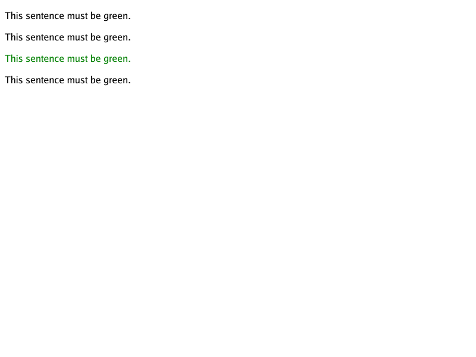

# Color keyword token regression

Issue [#181](https://github.com/lukehoban/simplebrowser/issues/181) fixes the
pinned WPT `colors/colors-007.xht`, now part of the 38-test benchmark manifest.
The fixture and its reference are unmodified upstream files at the revision
documented in [`testdata/wpt/README.md`](../testdata/wpt/README.md).

| Before | After |
| --- | --- |
|  |  |

Quoted strings and `#red` are not color keywords. Invalid `color` declarations
must be discarded **before** choosing a cascade winner, rather than falling
back to black during painting. CSS escapes in keyword identifiers are decoded
before case folding; a hex escape's optional whitespace terminator stays
inside its token.

The focused tests cover parser acceptance/rejection, lower-priority and
inherited computed styles, pixel equivalence, and the exact pinned WPT
reference. Refresh the after visual with:

```sh
go run ./cmd/simplebrowser -o docs/screenshots/color-keywords-after.png \
  testdata/wpt/colors/colors-007.xht
go test ./internal/browser -run 'Test(ColorKeyword|InvalidColor|WPTColorKeyword)'
```

The before visual was rendered using main `f53dbb1`. This change does not
expand the supported color function/keyword repertoire or implement SVG
`currentColor` ([#150](https://github.com/lukehoban/simplebrowser/issues/150)).
The 38-test benchmark integration remains in
[#159](https://github.com/lukehoban/simplebrowser/issues/159).
