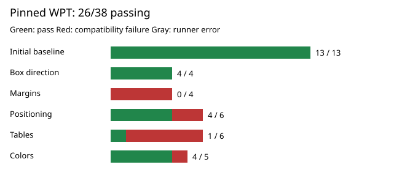

# WPT compatibility: 37/38 reference assertions passing

Pinned WPT revision: [`647d3bdf133159739b57cfb7afa0be3f5d76b9db`](https://github.com/web-platform-tests/wpt/commit/647d3bdf133159739b57cfb7afa0be3f5d76b9db). Viewport: 800x600. Exact PNG pixels; 1 compatibility failures, 0 runner errors. See [benchmark notes](../testdata/wpt/README.md) and [machine-readable results](compatibility.json).

| Test | Reference | Relation | Status | Different pixels |
| --- | --- | --- | --- | ---: |
| `colors/color-175.xht` | `colors/color-175-ref.xht` | match | **pass** | 0 |
| `colors/color-176.xht` | `reference/ref-this-text-should-be-green.xht` | match | **pass** | 0 |
| `colors/color-177.xht` | `colors/color-175-ref.xht` | match | **pass** | 0 |
| `colors/color-applies-to-001.xht` | `colors/color-applies-to-001-ref.xht` | match | **pass** | 0 |
| `backgrounds/background-001.xht` | `backgrounds/background-001-ref.xht` | match | **pass** | 0 |
| `backgrounds/background-002.xht` | `backgrounds/background-001-ref.xht` | match | **pass** | 0 |
| `normal-flow/block-formatting-contexts-001.xht` | `normal-flow/block-formatting-contexts-001-ref.xht` | match | **pass** | 0 |
| `normal-flow/block-formatting-contexts-003.xht` | `normal-flow/block-formatting-contexts-003-ref.xht` | match | **pass** | 0 |
| `normal-flow/block-formatting-contexts-005.xht` | `normal-flow/block-formatting-contexts-005-ref.xht` | match | **pass** | 0 |
| `normal-flow/block-formatting-context-height-001.xht` | `reference/ref-filled-black-96px-square.xht` | match | **pass** | 0 |
| `normal-flow/block-in-inline-align-001.html` | `normal-flow/block-in-inline-align-001-ref.html` | match | **pass** | 0 |
| `tables/anonymous-table-box-width-001.xht` | `reference/ref-filled-green-100px-square.xht` | match | **pass** | 0 |
| `tables/border-collapse-005.html` | `tables/border-collapse-005-ref.html` | match | **pass** | 0 |
| `box/ltr-basic.xht` | `box/left-ltr-ref.xht` | match | **pass** | 0 |
| `box/rtl-basic.xht` | `box/right-rtl-ref.xht` | match | **pass** | 0 |
| `box/ltr-ib.xht` | `box/left-ltr-ref.xht` | match | **pass** | 0 |
| `box/rtl-ib.xht` | `box/right-rtl-ref.xht` | match | **pass** | 0 |
| `margin-padding-clear/margin-001.xht` | `margin-padding-clear/margin-001-ref.xht` | match | **pass** | 0 |
| `margin-padding-clear/margin-002.xht` | `margin-padding-clear/margin-002-ref.xht` | match | **pass** | 0 |
| `margin-padding-clear/margin-003.xht` | `margin-padding-clear/margin-003-ref.xht` | match | **pass** | 0 |
| `margin-padding-clear/margin-004.xht` | `margin-padding-clear/margin-004-ref.xht` | match | **pass** | 0 |
| `positioning/absolute-non-replaced-height-003.xht` | `positioning/absolute-non-replaced-height-003-ref.xht` | match | **fail** | 5490 |
| `positioning/absolute-non-replaced-height-006.xht` | `positioning/absolute-non-replaced-height-006-ref.xht` | match | **pass** | 0 |
| `positioning/position-relative-001.xht` | `positioning/position-relative-001-ref.xht` | match | **pass** | 0 |
| `positioning/position-relative-003.xht` | `positioning/position-relative-003-ref.xht` | match | **pass** | 0 |
| `abspos/abspos-containing-block-initial-004a.xht` | `abspos/abspos-containing-block-initial-004-ref.xht` | match | **pass** | 0 |
| `abspos/abspos-containing-block-initial-007.xht` | `abspos/abspos-containing-block-initial-007-ref.xht` | match | **pass** | 0 |
| `tables/border-collapse-offset-001.xht` | `tables/border-collapse-offset-001-ref.xht` | match | **pass** | 0 |
| `tables/border-collapse-offset-002.xht` | `tables/border-collapse-offset-002-ref.xht` | match | **pass** | 0 |
| `tables/border-collapse-empty-row.html` | `tables/border-collapse-empty-row-ref.html` | match | **pass** | 0 |
| `tables/separated-border-model-007.xht` | `tables/separated-border-model-007-ref.xht` | match | **pass** | 0 |
| `tables/caption-position-001.xht` | `tables/caption-position-001-ref.xht` | match | **pass** | 0 |
| `tables/fixed-table-layout-002a.xht` | `tables/fixed-table-layout-002a-ref.xht` | match | **pass** | 0 |
| `colors/color-applies-to-004.xht` | `colors/color-applies-to-001-ref.xht` | match | **pass** | 0 |
| `colors/color-applies-to-005.xht` | `colors/color-applies-to-005-ref.xht` | match | **pass** | 0 |
| `colors/colors-007.xht` | `colors/colors-007-ref.xht` | match | **pass** | 0 |
| `colors/color-applies-to-002.xht` | `colors/color-applies-to-001-ref.xht` | match | **pass** | 0 |
| `colors/color-applies-to-003.xht` | `colors/color-applies-to-001-ref.xht` | match | **pass** | 0 |

On failures, run `make compatibility` and inspect `artifacts/wpt/<test>/` (test, reference, red pixel diff). A failure is a pixel mismatch, not a test process failure.
