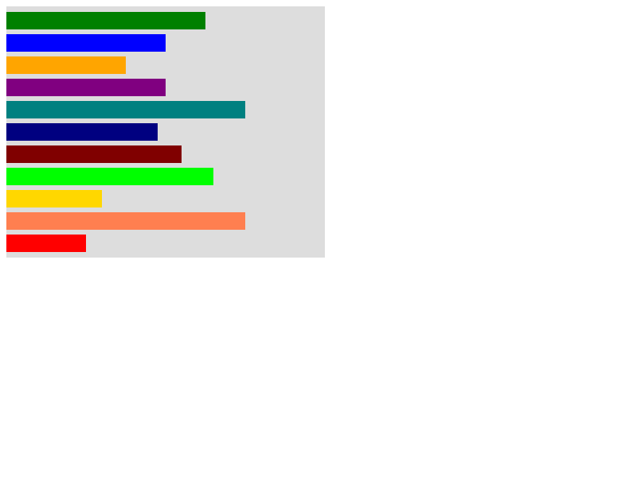
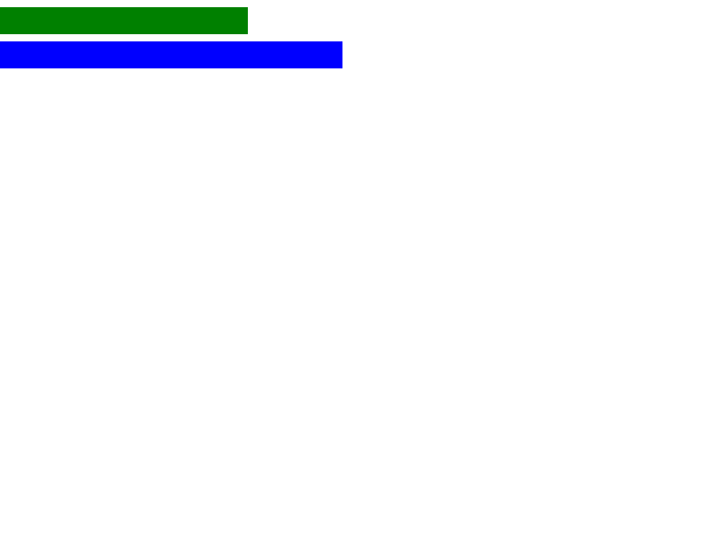

# CSS math length support

The renderer evaluates CSS math functions in the length properties its
layout engine uses: `width`, `height`, margins, padding, `flex-basis`, `gap`,
`row-gap`, `column-gap`, border widths, and `top`/`right`/`bottom`/`left` on
positioned boxes. Vertical offset percentages share the existing
width-based basis bug tracked in
[#216](https://github.com/lukehoban/simplebrowser/issues/216). The supported arithmetic is
`+`, `-`, `*`, and `/` over `px`, `em`, `rem`, `ex`, `ch`, `%`, `vw`, `vh`,
and unitless numbers, plus `min()` and `max()` (one or more comma-separated
arguments), `clamp(MIN, VAL, MAX)` (three arguments; either bound may be
`none`, and `MIN` wins if it exceeds `MAX`), `round()` with `nearest`, `up`,
`down`, and `to-zero` strategies, and the unary `abs()` and `sign()` functions.
`round()` defaults to `nearest`; halfway values round toward positive infinity.
Its step must be nonzero. `abs()` returns the absolute value, while `sign()`
returns the number `-1`, `0`, or `1` and can be combined with a length inside
`calc()`. These functions and `calc()` can be nested in each other and used as
a whole declaration value, for example
`width: min(250px, 300px)` or `width: calc(min(50%, 300px) - 10px)`. Addition and subtraction require CSS whitespace around
the operator. Font- and viewport-relative units are resolved when styles are
computed. Percentage terms are kept until layout and resolved against the
property's normal basis; a comparison that mixes percentages with other
lengths, such as `min(50%, 300px)`, is kept for layout evaluation (for a
non-negative property, as `calc(max(0px, min(50%, 300px)))`). Values for
non-negative properties are clamped to zero if math evaluates below zero;
when the sign depends on an unresolved percentage, the clamp is deferred until
layout. For example, width uses the containing block's content width, and
`flex-basis` uses the flex container's inner main size.
Border widths do not accept percentages, so a `calc()` there that includes
`%` is invalid.

Custom properties are substituted before validation and evaluation, preserving
the cascade. An invalid expression behaves like any other invalid declaration:
it does not replace a lower-priority declaration, and an invalid `var()`
substitution is treated as unset. `@supports` recognizes the same bounded
length grammar. The `margin`, `padding`, and `border-width` shorthands accept
one to four components, including a `calc()` expression in any component;
whitespace inside each expression is kept intact.

Percentage-only functions can be evaluated as percentages; math whose outcome
depends on a mixture of percentage and length terms remains deferred until the
layout basis is available. `sign()` by itself is a number, not a length, so a
length declaration can use it as a multiplier (for example,
`width: calc(sign(-50%) * -100px)`).

This is intentionally not a full CSS math implementation. These are not
supported yet:

- `mod()`, `rem()`, trigonometric functions, and other CSS math functions
- `calc()` inside the `flex` shorthand
  ([#288](https://github.com/lukehoban/simplebrowser/issues/288)); use
  `flex-basis` instead
- `calc()` mixed with other values in the `gap` shorthand, such as
  `gap: calc(10% - 1px) 0`
  ([#289](https://github.com/lukehoban/simplebrowser/issues/289))
- arithmetic in background, transform, grid, or SVG properties

`@supports` accepts only the forms listed above as supported.

Reproduce the `min()`/`max()`/`clamp()` and `round()`/`abs()`/`sign()` cases
([#281](https://github.com/lukehoban/simplebrowser/issues/281),
[#445](https://github.com/lukehoban/simplebrowser/issues/445)):

```sh
go run ./cmd/simplebrowser -o /tmp/min-max-clamp.png testdata/css-math/min-max-clamp.html
```

Inside the 400px gray frame the bars are 250px (`min(250px, 300px)`), 200px
(`min(50%, 300px)`), 150px (`max(10%, 150px)`), 200px
(`clamp(100px, 50%, 300px)`), 300px (`clamp(10px, 90%, 300px)`), 190px
(`calc(min(50%, 300px) - 10px)`) and 220px (`min(var(--w), 60%)` with
`--w: 220px`). Additional bars show `round(nearest, 257px, 10px)` at 260px,
`abs(-120px)` at 120px, `clamp(none, 90%, 300px)` at 300px, and `sign()` in
`calc()` at 100px:



Reproduce the tracked ordinary-width case:

```sh
go run ./cmd/simplebrowser -o /tmp/calc-width.png testdata/wikipedia-moon/repros/calc-width.html
```

The green and blue bars are 275px and 380px wide respectively:



Reproduce the flex-basis case:

```sh
go run ./cmd/simplebrowser -o /tmp/calc-flex-basis.png testdata/wikipedia-moon/repros/calc-flex-basis.html
```

In the 400px rows, the green item is 190px (`calc(50% - 10px)`), the blue
item is 200px (`50%`), and the orange item is 120px (`calc(100px + 20px)`):


