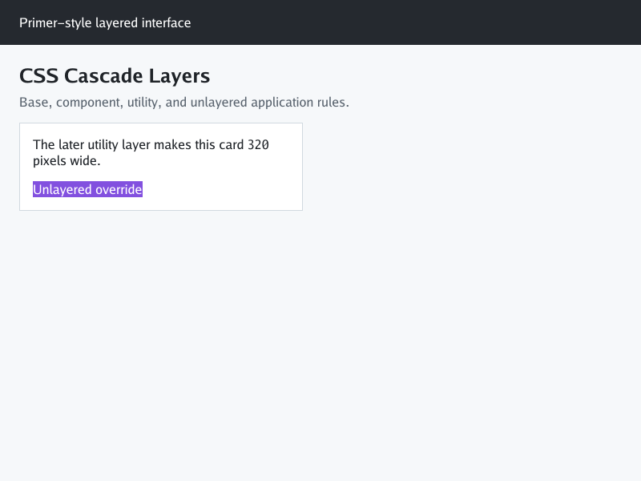

# CSS Cascade Layers

The renderer parses named, anonymous, nested, and dotted `@layer` blocks,
ordering statements, and rules nested in supported `@media` and `@supports`
conditions. Named-layer order is shared across author stylesheets in document
order; layer statements and blocks inside `@media` establish order only when
the query matches the rendering viewport. Normal declarations prefer later
layers and unlayered declarations; `!important` reverses that order. Layer
precedence is resolved before specificity and source order. Presentational
hints remain below author CSS.

The fixture below uses Primer-style reset, base, component, and utility layers,
plus an unlayered application override:



The public `microsoft/vscode` page was also freshly rendered at the default
800×600 viewport while this implementation was in progress. This is a
diagnostic capture, not #330 acceptance evidence: repository rows are visible,
but they remain clipped and the page has known layout differences.


Run it locally with:

```sh
go run ./cmd/simplebrowser -o /tmp/cascade-layers.png testdata/cascade-layers/index.html
```

Layer names currently use the renderer's ASCII identifier subset; CSS escapes
and non-ASCII identifiers are not implemented. Other unsupported at-rules
remain outside this feature. See [issue #354](https://github.com/lukehoban/simplebrowser/issues/354).
