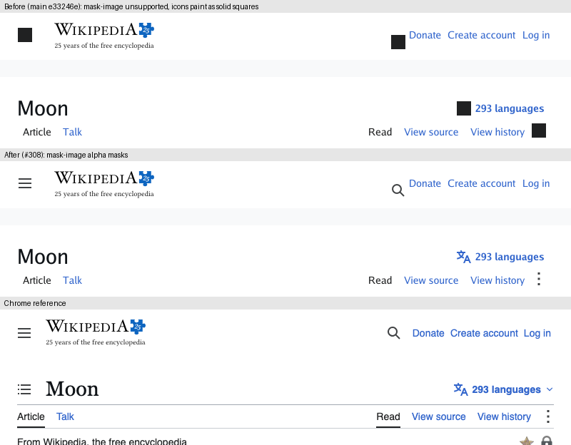

# CSS masking

The renderer implements a bounded subset of [CSS Masking 1](https://drafts.fxtf.org/css-masking-1/) in `internal/browser/mask.go`. It was added for Wikipedia Vector's header icons ([#308](https://github.com/lukehoban/simplebrowser/issues/308)).

## Supported

- `mask-image`: comma-separated layers of `none`, `url()` and gradients. A `url()` can point to a fixture-relative or `data:` SVG, PNG, JPEG or GIF image. Each layer's alpha channel is the mask (`mask-mode: match-source` for images).
- `mask-size`, `mask-position` and `mask-repeat` (`repeat`, `no-repeat`, `repeat-x`, `repeat-y`). These use the same used-value code as `background-*`. The mask positioning area is the border box.
- `mask-size` components may use nested `calc()`, `min()` and `max()`, which are evaluated at computed-value time. This covers Vector's `calc(max(calc(1rem + 4px), 10px))`. General `min()`/`max()` for other lengths is [#281](https://github.com/lukehoban/simplebrowser/issues/281).
- The `mask` shorthand, limited to those image/position/size/repeat components. A color makes it invalid.
- `-webkit-mask*` aliases. Prefixed and unprefixed declarations cascade as one property.
- `@supports` reports true for exactly these properties and values, so Vector selects its mask branches, as Chrome does.

## Painting model

- An element with at least one non-`none` mask layer forms a stacking context. If it is not positioned, it paints in the z-index 0 layer, as `opacity` does.
- The element's whole stacking context (background, borders, content and descendants) is painted offscreen. It is then composited through the union of its mask layers (`mask-composite: add`), clipped to the border box (`mask-clip: border-box`).
- A mask image that fails to load or decode counts as a transparent layer, so the element is hidden rather than painted as an opaque box.

## Not supported

- Masks on non-atomic inline elements: [#313](https://github.com/lukehoban/simplebrowser/issues/313).
- `mask-mode: luminance`, `mask-origin`/`mask-clip` values other than `border-box`, `mask-composite` values other than `add`, two-value/`space`/`round` repeats, and SVG `<mask>` references: [#314](https://github.com/lukehoban/simplebrowser/issues/314).
