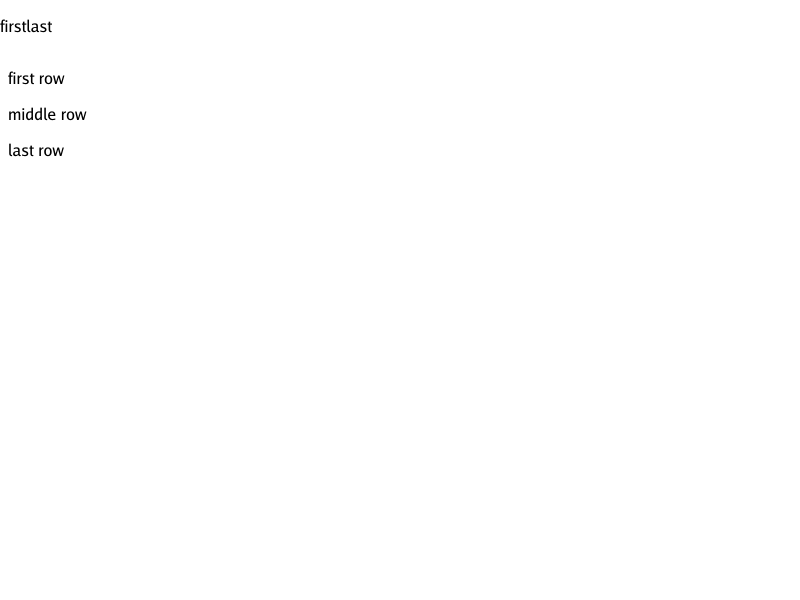
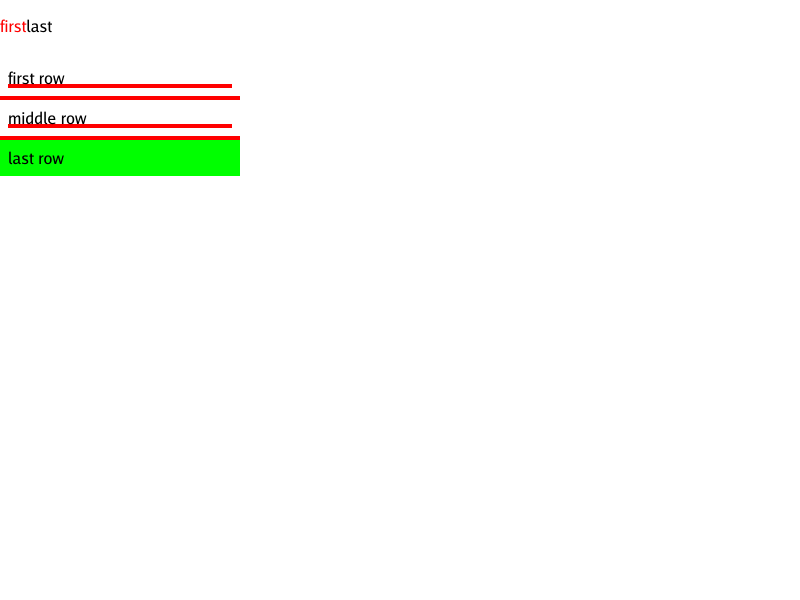

# Structural selector subset

The renderer supports `:last-child` and bounded `:not()` alongside its existing
type, universal, ID, class, descendant, child, and static link selectors.

- `:last-child` counts **element siblings**, including `display:none` elements;
  trailing text and comments do not matter. A parentless element also matches.
- `:not()` accepts an unforgiving comma-separated list using the supported
  grammar, including nested negation up to **16 levels**.
- Negation contributes the **lexicographically greatest argument specificity**,
  not its own pseudo-class unit. Repeated negations add their contributions.
  Normal source order, inline priority, and `!important` still apply.
- Malformed or unsupported arguments reject the containing selector list/rule.
  In particular, unknown pseudo-classes must not turn negation into match-all.
  Recognized dynamic states (`:hover`, `:active`, `:focus`, `:visited`) remain
  false in this static, unvisited renderer, including inside negation.

## Visual regression

Render `testdata/selectors/not-last-child.html` to reproduce:

| Before | After |
| --- | --- |
|  |  |

The first span now gets red text, non-final rows get red borders, and the final
row gets a lime background. The final span's computed background is lime too,
but text-bearing inline backgrounds are an independent painting limitation
tracked in [#197](https://github.com/lukehoban/simplebrowser/issues/197).

`TestEmptyRowReferenceSelectors` checks the unmodified pinned WPT
`tables/border-collapse-empty-row-ref.html` against equivalent explicit row
classes. `TestEmptyRowPinnedReftest` verifies complete test/reference equality
with the collapsed-row painting fix [#178](https://github.com/lukehoban/simplebrowser/issues/178).

## Known gaps / follow-ups

- [#198](https://github.com/lukehoban/simplebrowser/issues/198): attribute selectors.
- [#199](https://github.com/lukehoban/simplebrowser/issues/199): `+` / `~` sibling combinators.
- Other functional pseudo-classes and pseudo-elements remain unsupported.
- The empty-row WPT pair also exercises independently deferred
  [empty inline-block sizes (#192)](https://github.com/lukehoban/simplebrowser/issues/192)
  and [inline-table flow (#193)](https://github.com/lukehoban/simplebrowser/issues/193);
  pixel agreement alone does not establish full browser conformance.
