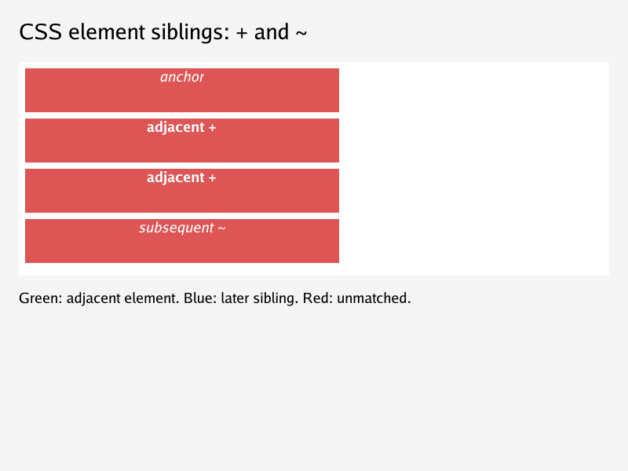
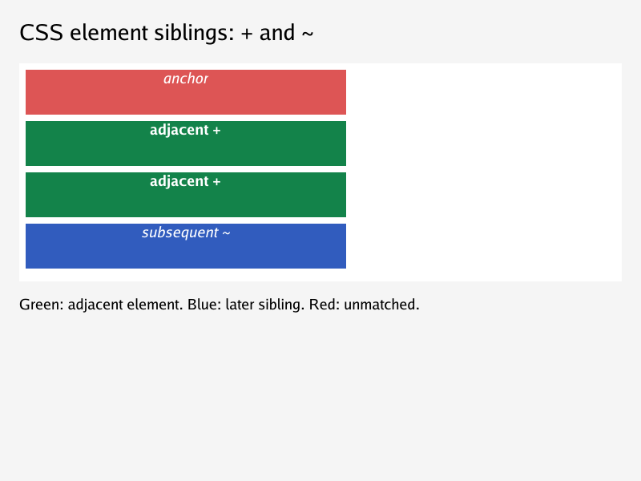
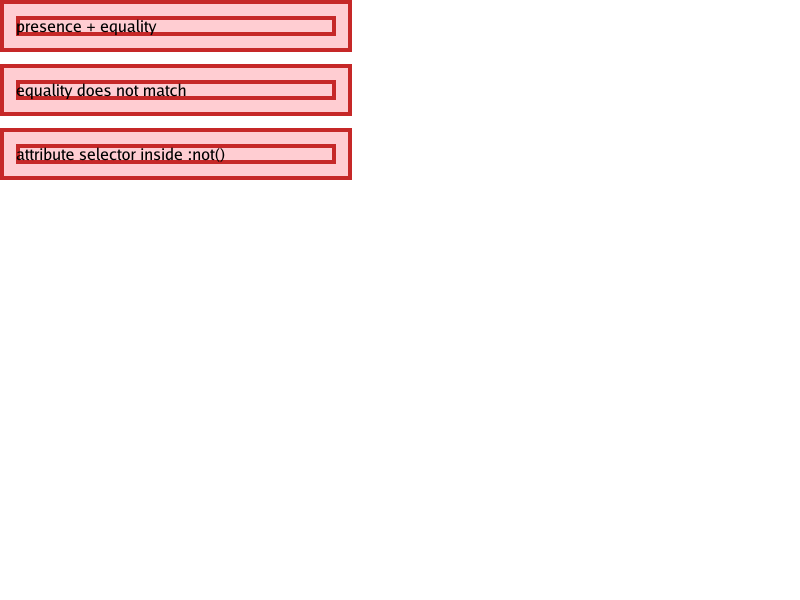
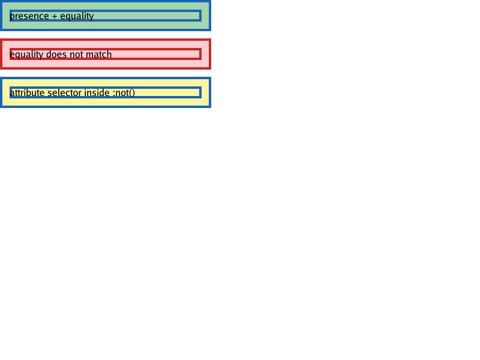

# Structural selector subset

The renderer supports `[name]` and `[name=value]`, `:first-child`,
`:last-child`, bounded `:not()` alongside type, universal, ID, class,
descendant, child, adjacent (`+`), general sibling (`~`), and static link
selectors.

- `+` looks at the nearest preceding **element** sibling; `~` looks at all
  preceding element siblings under the same parent. Text and comment nodes
  are ignored. Combinators also work inside supported `:not()` arguments.

- Attribute names follow the HTML parser's case-insensitive lookup. Values are
  case-sensitive and may be identifiers or quoted strings. Attribute selectors
  contribute class-level specificity and work inside `:not()`.
- Other attribute operators and selector modifiers remain unsupported. They
  reject the containing selector list/rule rather than matching approximately.
- `:first-child` and `:last-child` count **element siblings**, including
  `display:none` elements; surrounding text and comments do not matter. A
  parentless element also matches either selector.
- `:not()` accepts an unforgiving comma-separated list using the supported
  grammar, including nested negation up to **16 levels**.
- Negation contributes the **lexicographically greatest argument specificity**,
  not its own pseudo-class unit. Repeated negations add their contributions.
  Normal source order, inline priority, and `!important` still apply.
- Malformed or unsupported arguments reject the containing selector list/rule.
  In particular, unknown pseudo-classes must not turn negation into match-all.
  Recognized dynamic states (`:hover`, `:active`, `:focus`, `:visited`) remain
  false in this static, unvisited renderer, including inside negation.

## Visual regression

Render `testdata/selectors/not-last-child.html` to reproduce:

| Before | After |
| --- | --- |
|  |  |

The first span now gets red text, non-final rows get red borders, and the final
row gets a lime background. The final span's background is painted now that
the independent inline painting fix [#197](https://github.com/lukehoban/simplebrowser/issues/197)
has landed; the earlier visual above records the selector-specific change.

Render `testdata/css/sibling-combinators.html` for the sibling regression:

| Before | After |
| --- | --- |
|  |  |

The focused attribute-selector fixture shows presence, equality, and negated
presence:

| Before | After |
| --- | --- |
|  |  |

`TestEmptyRowReferenceSelectors` checks the unmodified pinned WPT
`tables/border-collapse-empty-row-ref.html` against equivalent explicit row
classes. `TestEmptyRowPinnedReftest` verifies complete test/reference equality
with the collapsed-row painting fix [#178](https://github.com/lukehoban/simplebrowser/issues/178).

## Known gaps / follow-ups

- `::before`/`::after` generate boxes for string `content`; see
  [generated content](generated-content.md). Other functional pseudo-classes
  and other pseudo-elements remain unsupported.
- The empty-row WPT pair also exercises independently deferred
  [empty inline-block sizes (#192)](https://github.com/lukehoban/simplebrowser/issues/192)
  and [inline-table flow (#193)](https://github.com/lukehoban/simplebrowser/issues/193);
  pixel agreement alone does not establish full browser conformance.
