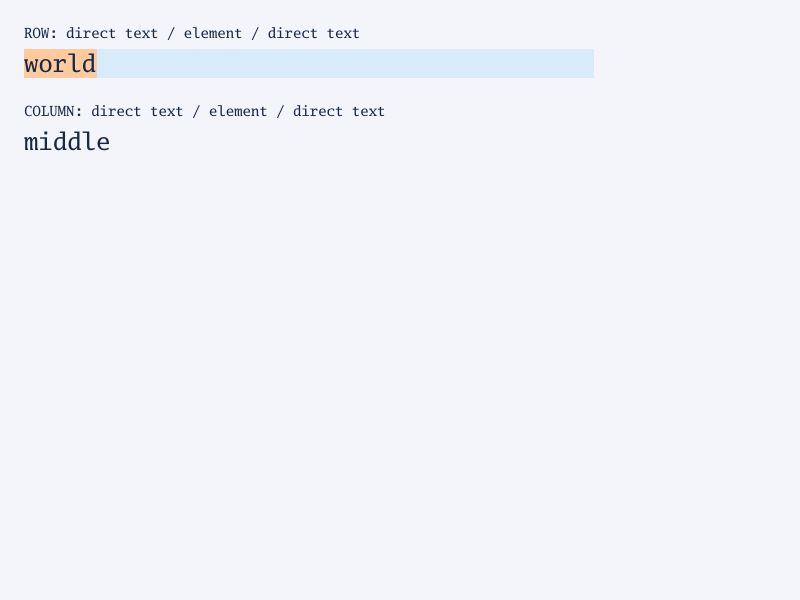
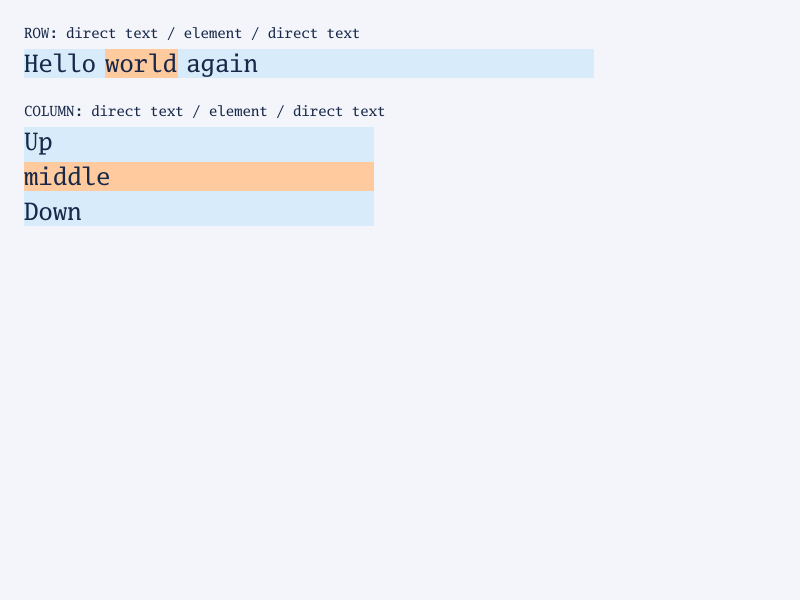

# Direct text in flex containers (#278)

The checked-in [fixture](../testdata/flex/anonymous-text.html) exercises one
row and one column of direct text beside an element. Render it with
`go run ./cmd/simplebrowser -o /tmp/flex-text.png testdata/flex/anonymous-text.html`.

| Before: direct text disappeared | Current: text participates in flex layout |
| --- | --- |
|  |  |

Contiguous direct text nodes form a single anonymous item; runs of only
collapsible white space do not form items, but a no-break space (`&nbsp;`)
is content and does. Row/column adjacency and painted text pixels are tested.
This does **not** imply full CSS Flexbox support: multi-line wrapping is
tracked in [#272](https://github.com/lukehoban/simplebrowser/issues/272).
The site-specific progress and remaining gaps are tracked in
[GitHub #242](https://github.com/lukehoban/simplebrowser/issues/242) and
[Moon #243](https://github.com/lukehoban/simplebrowser/issues/243).
