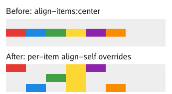
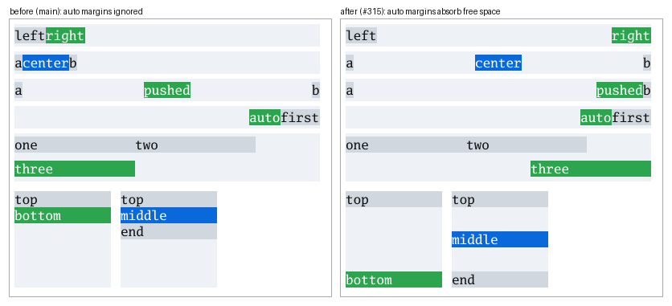

# Flexbox support

`display:flex` / `inline-flex` is implemented as a deliberately bounded
formatter (`internal/browser/flex.go`), sized for the pinned
[GitHub](github-vscode-baseline.md) and [Moon](wikipedia-moon-baseline.md)
views. It is not a complete CSS Flexbox implementation.

The repro is [`testdata/flex/wrap.html`](../testdata/flex/wrap.html): a
`flex-wrap:wrap` row (issue #272's two 60px items), a `wrap-reverse` row whose
second line flexes to full width, and a wrapping column whose lines share the
free width. The final column has two auto-width items in separate 90px lines;
its second item must stay inside the 180px container.

## Supported

- `flex-direction` row, column and their `-reverse` forms.
- `flex`, `flex-grow`, `flex-shrink`, `flex-basis`, with min/max freezing
  ([#247](https://github.com/lukehoban/simplebrowser/issues/247)).
- Row flex items use a content-based minimum for `min-width:auto`, except
  scroll containers; an explicit `min-width` (including `0`) overrides it.
  This prevents shrunken items from painting their min-content text over
  neighboring controls, as in the [GitHub count-badge repro](github-vscode-count-badges.md)
  ([#375](https://github.com/lukehoban/simplebrowser/issues/375)). The full
  specification's content-size/transferred-size clamping is not implemented.
- `gap`, `row-gap`, `column-gap` between items and between lines.
- `justify-content`: start/flex-start, end/flex-end, center, space-between,
  space-around, space-evenly (per line).
- `align-items`: stretch (default), start/flex-start, end/flex-end, center.
- `align-self`: auto (the `align-items` value), stretch, start/flex-start,
  end/flex-end, self-start, self-end and center on individual items. Stretch
  applies only to items without an explicit cross size; alignment is resolved
  independently for each item on every flex line, including `wrap-reverse`
  ([#283](https://github.com/lukehoban/simplebrowser/issues/283)).
- Main-axis `margin:auto`: positive remaining free space on a line is split
  equally between that line's `auto` main margins before `justify-content`
  runs, so justification has nothing left to distribute
  ([#315](https://github.com/lukehoban/simplebrowser/issues/315)). Zero or
  negative free space leaves them at zero. **Known gap:** the existing
  justification path clamps negative free space, so overflowing
  `justify-content:flex-end` does not reach the end; see
  [#342](https://github.com/lukehoban/simplebrowser/issues/342). Distribution
  is physical, so it also covers `row-reverse` / `column-reverse`, and it runs
  per line when wrapping. An odd remainder pixel lands on the last auto margin.
  
  ([`testdata/flex/auto-main-margins.html`](../testdata/flex/auto-main-margins.html))
- `flex-wrap: wrap | wrap-reverse`
  ([#272](https://github.com/lukehoban/simplebrowser/issues/272)): items break
  onto a new line before one whose min/max-clamped hypothetical outer size
  would overflow; each line flexes independently; `wrap-reverse` stacks lines
  from the cross end and swaps cross-start/end alignment.
- `align-content` on multi-line containers: normal/stretch (the default
  distributes free cross space to the lines), start/flex-start, end/flex-end,
  center, space-between, space-around, space-evenly. With overflowing wrapped
  lines, center and end offset the lines into negative cross space (including
  any cross-axis gap); explicit safe/unsafe keywords remain unsupported
  ([#297](https://github.com/lukehoban/simplebrowser/issues/297)).
  [Overflow alignment render](screenshots/flex-align-content-overflow.png)
  compares logical `end` with flex-relative `flex-end` under `wrap-reverse`
  for positive and negative free space in row and column containers.
- Intrinsic (shrink-to-fit) widths: a row's max-content width is its items
  plus gaps on one line; its min-content width is the widest item when
  wrapping, else the sum of items. Each row item's contribution is clamped by
  an inflexible *definite length* flex base size and then by length
  `min-width`/`max-width`
  ([#291](https://github.com/lukehoban/simplebrowser/issues/291)). Percentage
  bases — including the `0%` implied by `flex:<number>` and
  `flex:<number> <number>`, and mixed `calc()` — are indefinite while the
  container is being measured, so those items keep their content
  contribution; an explicit `flex:0 0 0px` stays definite.
  [Implied 0% basis: before](screenshots/flex/unitless-basis-intrinsic-before.png)
  · [after](screenshots/flex/unitless-basis-intrinsic-after.png)
  ([`testdata/flex/unitless-basis-intrinsic.html`](../testdata/flex/unitless-basis-intrinsic.html)).
- Direct text children become anonymous flex items, including NBSP-only runs
  ([#278](https://github.com/lukehoban/simplebrowser/issues/278)).

## Not supported

- Wrapping in an auto-height column (no definite main size, so it never
  wraps; this matches browsers without `max-height`).
- Cross-axis `margin:auto` (ignored; alignment is resolved from
  `align-items`/`align-self` only)
  ([#325](https://github.com/lukehoban/simplebrowser/issues/325)).
- `order`, baseline alignment, `safe`/`unsafe` and
  `first`/`last` keywords, `place-content`, and the remaining automatic
  minimum-size rules (including the column-axis `min-height:auto` behavior).
