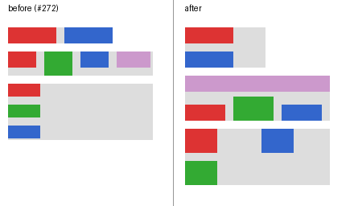

# Flexbox support

`display:flex` / `inline-flex` is implemented as a deliberately bounded
formatter (`internal/browser/flex.go`), sized for the pinned
[GitHub](github-vscode-baseline.md) and [Moon](wikipedia-moon-baseline.md)
views. It is not a complete CSS Flexbox implementation.

The repro is [`testdata/flex/wrap.html`](../testdata/flex/wrap.html): a
`flex-wrap:wrap` row (issue #272's two 60px items), a `wrap-reverse` row whose
second line flexes to full width, and a wrapping column whose lines share the
free width.

## Supported

- `flex-direction` row, column and their `-reverse` forms.
- `flex`, `flex-grow`, `flex-shrink`, `flex-basis`, with min/max freezing
  ([#247](https://github.com/lukehoban/simplebrowser/issues/247)).
- `gap`, `row-gap`, `column-gap` between items and between lines.
- `justify-content`: start/flex-start, end/flex-end, center, space-between,
  space-around, space-evenly (per line).
- `align-items`: stretch (default), start/flex-start, end/flex-end, center.
- `flex-wrap: wrap | wrap-reverse`
  ([#272](https://github.com/lukehoban/simplebrowser/issues/272)): items break
  onto a new line before one whose min/max-clamped hypothetical outer size
  would overflow; each line flexes independently; `wrap-reverse` stacks lines
  from the cross end and swaps cross-start/end alignment.
- `align-content` on multi-line containers: normal/stretch (the default
  distributes free cross space to the lines), start/flex-start, end/flex-end,
  center, space-between, space-around, space-evenly.
- Intrinsic (shrink-to-fit) widths: a row's max-content width is its items
  plus gaps on one line; its min-content width is the widest item when
  wrapping, else the sum of items.

## Not supported

- Wrapping in an auto-height column (no definite main size, so it never
  wraps; this matches browsers without `max-height`).
- Direct text children as anonymous items
  ([#278](https://github.com/lukehoban/simplebrowser/issues/278)).
- `order`, `align-self`, baseline alignment, `safe`/`unsafe` and
  `first`/`last` keywords, `place-content`, and automatic minimum sizes
  (`min-width:auto` resolves to 0).
