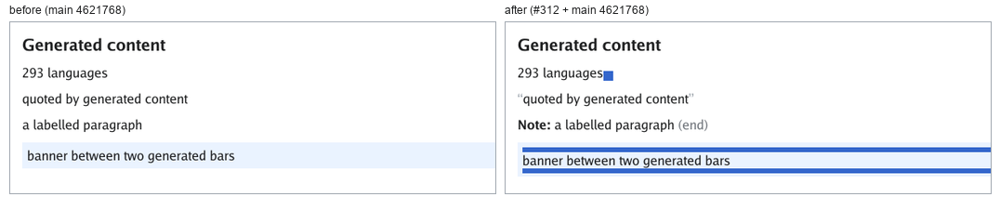
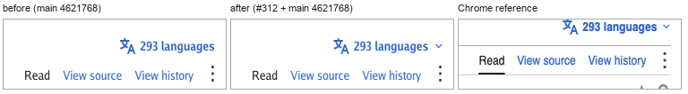

# Generated content (`::before` / `::after`)

`::before` and `::after` selectors whose `content` computes to a string
sequence generate an element-like box that is the originating element's first
or last child. The generated box takes part in the ordinary cascade, layout and
paint paths, so inheritance, `display`, box model properties, backgrounds and
borders and `mask-image` all apply to it.



*Left: `main` before generated content, which paints only the elements' own
children. Right: the same
[offline fixture](../testdata/generated-content/index.html) with
`::before`/`::after` boxes.*

Reproduce with:

```sh
go run ./cmd/simplebrowser -o out.png testdata/generated-content/index.html
```

## Supported

* `content: none` and `content: normal` generate no box.
* `content: <string>+` generates a box containing the concatenated strings,
  with CSS escapes (`"\201C"`), escaped quotes and line continuations
  (a backslash before LF, CRLF, CR or form feed) decoded. A bad string, one
  whose closing quote is missing or escaped (`"x\"`) or that contains a raw
  newline, makes the declaration invalid.
* `content: ""` still generates a box. That is how icon-shaped pseudo-elements
  such as Vector's dropdown chevron are written, and it is why an empty string
  is not treated like `none`.
* The legacy one-colon spellings `:before` and `:after` are pseudo-elements
  too, and a pseudo-element adds type-level specificity in either spelling, so
  `p:before` and `p::before` tie and source order decides.
* Generated boxes inherit from their originating element, but never pick up its
  `style` attribute or presentational attributes.

## Not generated

Conservatively, nothing is painted when a generated box would be wrong:

* Any other `content` value — `url()`, `attr()`, counters, quotes — generates
  no box ([#327](https://github.com/lukehoban/simplebrowser/issues/327)).
* Replaced and void elements (`img`, `br`, `input`, …) have no generated
  children.
* A `display:none` originating element, or a generated box with its own
  `display:none`, generates nothing.
* Pseudo-elements other than `::before`/`::after`, and pseudo-elements that are
  not in a selector's last compound, never match.

## On the Moon page

The Vector language dropdown's chevron is an empty-string `::after` box sized
by `width`/`height` and drawn with `mask-image`. Both generated content (#312)
and mask painting ([#308](https://github.com/lukehoban/simplebrowser/issues/308),
implemented in [CSS mask support](css-mask.md)) are present in the current
renderer, so the chevron now paints as a glyph rather than a solid square.


