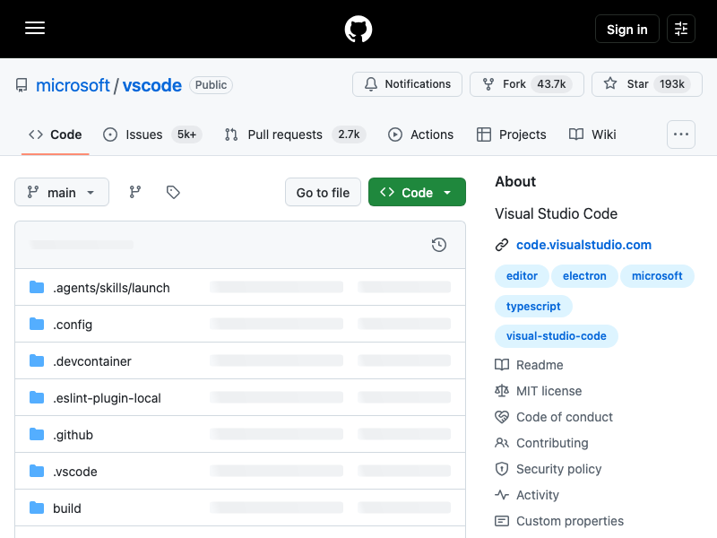
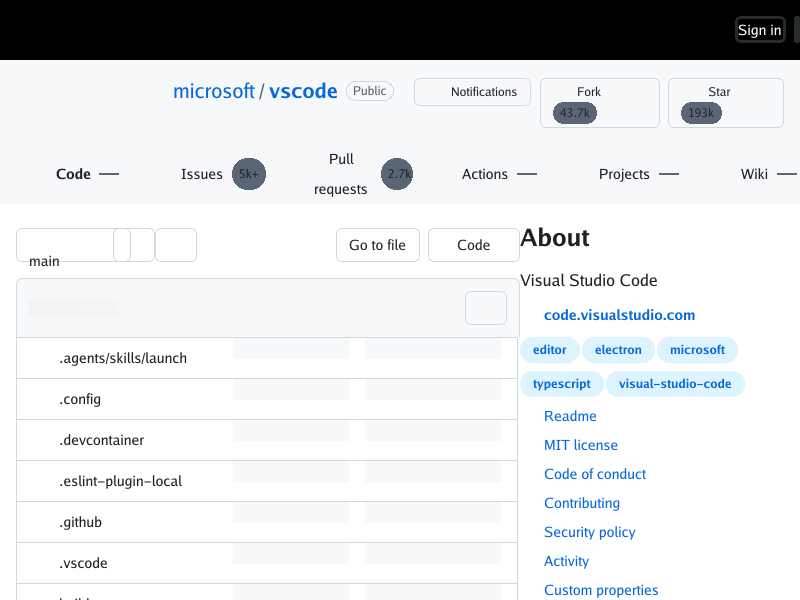

# GitHub repository filename clipping

The public, logged-out `https://github.com/microsoft/vscode` response contains
the complete repository paths in its file-row markup. For example, the first
row contains `.agents/skills/launch`, while its rendered text was displaced
about 29px to the right of its own truncation box and clipped. A clean-profile
Chrome capture at the same 800×600 viewport shows the complete names. This
identified a renderer layout defect, not missing page content or a viewport
crop.

The deterministic reduced reproduction is
[`testdata/github-vscode/repros/filename-clipping.html`](../testdata/github-vscode/repros/filename-clipping.html):

```sh
go run ./cmd/simplebrowser -o /tmp/filename-clipping.png \
  testdata/github-vscode/repros/filename-clipping.html
```

## Current visual evidence

These are 800×600 captures. The renderer does not execute JavaScript. The
logged-out Chrome image is a practical visual reference, not a JS-off pixel
parity oracle.

| simplebrowser before (main `1478bb5`) | clean-profile Chrome | simplebrowser after (main `46e0f3f` plus fix) |
| --- | --- | --- |
|  |  |  |

The fixture also records the isolated behavior before and after:

| fixture before | fixture after |
| --- | --- |
|  |  |

The original live response named `.agents/skills/launch`, `.config`,
`.devcontainer`, `.eslint-plugin-local`, `.github`, and `.vscode` in its first
rows. In the before capture, those labels appear only as `.agents/skills/la`,
`.c`, `.devcont`, `.eslint-plugin-`, `.g`, and `.vs`. The HTML's file-row
text and accessible labels contain the full names.

## Cause and correction

Table layout supplied a text pen origin as an absolute coordinate at the
table-cell content edge. Descendant block and flex formatting contexts reused
that absolute origin instead of rebasing it at their own line start. In the
reduced fixture, `.config`'s text run started at x=84 while its truncation box
started at x=55; `overflow: hidden` correctly clipped the displaced glyphs.

The table now passes only its fractional column phase. Each line adds that
phase to its own start coordinate. Direct table text still retains the
fractional placement needed across adjacent columns, while nested flex and
block content starts within its own box. The regression test checks that all
six filename text runs remain inside their respective truncation boxes.

## Remaining gap

If a filename genuinely exceeds the available width, the renderer currently
clips it without painting the CSS `text-overflow: ellipsis` marker. That
separate behavior is tracked in
[#402](https://github.com/lukehoban/simplebrowser/issues/402), with a
deterministic screenshot below. This change fixes the demonstrated offset for
names that fit; it does not implement text-overflow painting.


Reproduce it with
[`testdata/github-vscode/repros/text-overflow-ellipsis.html`](../testdata/github-vscode/repros/text-overflow-ellipsis.html).

This live-page behavior is a sub-issue of
[#330](https://github.com/lukehoban/simplebrowser/issues/330) and
[#154](https://github.com/lukehoban/simplebrowser/issues/154). The adjacent
branch-control and metadata-placeholder gaps remain in
[#377](https://github.com/lukehoban/simplebrowser/issues/377) and
[#378](https://github.com/lukehoban/simplebrowser/issues/378). The independent
`white-space: nowrap` work in [#380](https://github.com/lukehoban/simplebrowser/issues/380)
has merged.
