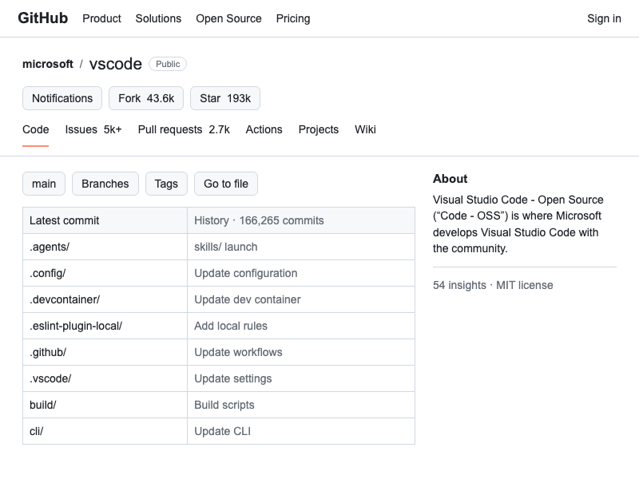
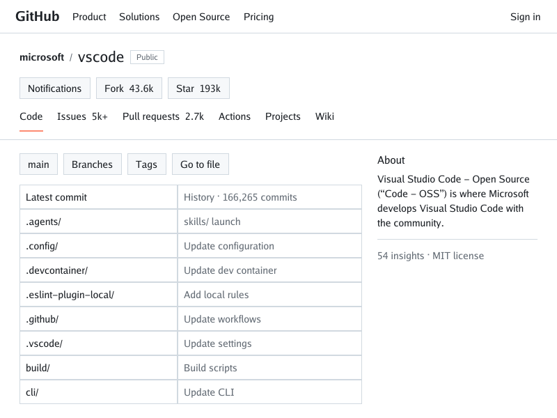
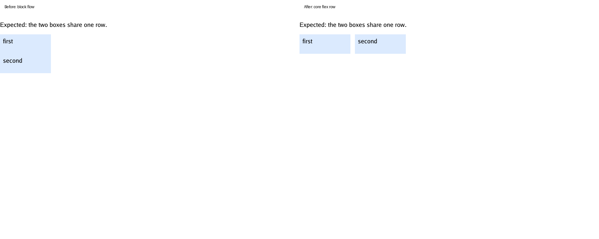
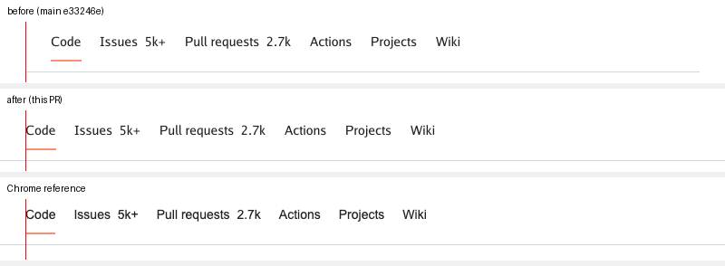

# GitHub repository-page baseline (structural stand-in)

This is a deterministic, offline **baseline, not a golden success** for the
public, logged-out `microsoft/vscode` repository page at an 800×600 viewport.
It is not a screenshot or faithful capture of GitHub. The checked-in fixture
is an authored, script-free stand-in assembled from a read-only public page
inspection; it provides representative repository header, tabs, file list,
and About landmarks while making the current renderer's limitations visible.

- **Chrome reference:**

  

  [`chrome-reference.png`](screenshots/github-vscode/chrome-reference.png) is
  headless Google Chrome 154.0.8037.58 on macOS rendering the same offline
  fixture over local HTTP at 800×600, device scale 1.
- **Current simplebrowser baseline:**

  

  [`baseline.png`](screenshots/github-vscode/baseline.png) is today's
  simplebrowser output. It is a **diagnostic record, not a golden**: no CI job
  compares it. Refresh it with `make github-vscode-baseline` when the renderer
  changes. `make baselines` refreshes this diagnostic together with the Moon
  diagnostic and blocking HN golden.

## Reproduce

From the repository root, with Go installed and module dependencies cached
(the fixture itself needs no network):

```sh
make github-vscode-baseline
```

The input is [`testdata/github-vscode/index.html`](../testdata/github-vscode/index.html).
The renderer's viewport is 800×600.

The checked-in Chrome reference was made from a clean local profile while
serving the committed fixture (no external network is needed). Start the
server in one terminal:

```sh
python3 -m http.server 8765 --bind 127.0.0.1 --directory testdata
```

Then, from the repository root in a second terminal, capture with Chrome
154.0.8037.58 (a different browser version or host font environment may
produce different pixels):

```sh
"/Applications/Google Chrome.app/Contents/MacOS/Google Chrome" \
  --headless=new --disable-gpu --hide-scrollbars --no-first-run \
  --no-default-browser-check --user-data-dir="$(mktemp -d)" \
  --window-size=800,600 --force-device-scale-factor=1 \
  --screenshot=docs/screenshots/github-vscode/chrome-reference.png \
  http://127.0.0.1:8765/github-vscode/index.html
```

The command is intentionally documented rather than made a portable Make
target: a browser executable and its path are host-specific. Documentation
shows the pinned reference and current baseline separately so only the current
renderer output needs refreshing.

The reference is pinned to the original capture in PR #264, with SHA-256
`08d37263f4de629f6d9968590a51210b29b9a7ca89438e9fea3c1a80e2747b9e`.
Integrating main `c24a989a5b0142bbe74c24b729a30d597bfc8f91` (media-query
evaluation) left the GitHub baseline byte-identical across two regenerations
and unchanged from the original PR: this stand-in contains no media queries.
Integrating main `e3917f8d08751dc91aefc3167d7481303104859d` (overflow
clipping) also left the baseline byte-identical in a fresh render. Both
the Chrome reference and current baseline remain individual 800×600 images.

## Source, scope, and asset notes

- Source inspected: `https://github.com/microsoft/vscode`, public logged-out
  HTML response, fetched 2026-09-27 UTC. This records a point-in-time page
  inspection, not a promise that live content remains unchanged.
- The page identified itself as “GitHub - microsoft/vscode: Visual Studio
  Code · GitHub”; its rendered text included the public badge, Code/Issues/
  Pull requests/Actions/Projects/Wiki navigation, the `main` branch, a
  166,265-commit count, repository file rows, and an About description.
- The inspected HTML response had 27 linked stylesheets, 10 script references,
  3 `` references, and inline SVG markup. This is a document inventory,
  not a claim that every resource is visible in the first viewport. It
  references GitHub-hosted stylesheets/scripts/icons/fonts and external
  README images (including shields and a signed user-image URL); none are
  vendored or fetched by this fixture. Scripts, authentication state,
  user-generated media, external requests, and the rest of the page are
  excluded. The stand-in has no external asset requests and contains no
  copied image, font, stylesheet, script, credential, or browser cookie.
- The `microsoft/vscode` repository declares the MIT license for its project
  code; that does not grant a license to redistribute GitHub's HTML, CSS,
  brand assets, or the external images referenced by the live page. No
  redistribution license for those GitHub page resources was identified, so
  they are not included. The fixture uses original markup and neutral,
  hand-authored CSS, with short repository labels and counts observed in the
  public response.
- The real-browser reference is only evidence for this original offline
  stand-in. It does not make the stand-in a screenshot or faithful capture of
  GitHub, and copying the live page's visual assets/styles remains unnecessary
  and out of scope.

## Inspected layout and evidence-backed gaps

The public response linked GitHub/Primer and repository/code stylesheets,
with behavior scripts; the markup included responsive navigation,
button-like controls, repository navigation, a file table, inline SVG/icon
content, and README images. In the repository header, the inspected DOM uses
classes including `d-flex`, `UnderlineNav`, and `UnderlineNav-item`. The
linked Primer CSS gives `.UnderlineNav` `display:flex` and
`justify-content:space-between`, and gives `.UnderlineNav-item`
`display:flex`, `align-items:center`, and
`color:var(--fgColor-default)`. Thus both flex layout and ordinary CSS
custom-property substitution are confirmed in actual repository-page
navigation markup/styles, not inferred from the stand-in. The stand-in uses
hand-authored `display:flex`, `gap`, `align-items`, flexible sizing, a table,
and `--...`/`var(...)` declarations to provide a stable local approximation
of those mechanisms; it is not GitHub's original CSS.

The baseline PNG shows the fixture's single-line flex rows, gaps and flexible
main column beside the About panel. Core `flex`/`inline-flex` row and column
placement, flex sizing, `gap`, `justify-content`, and `align-items` are
implemented for this pinned view; see [flexbox support](flexbox.md) for the
bounded scope, including multi-line wrapping. The renderer
also resolves inherited custom-property theme colors. The table and text are
visible; this remains a diagnostic, not parity evidence.

The isolated flex repro before and after the formatter:



Negative horizontal margins ([#285](https://github.com/lukehoban/simplebrowser/issues/285))
let the tab row's `margin: 0 -28px` reach the page edges, so the tabs start
at x=28 and the bottom border spans the viewport, as in the Chrome reference:



[The focused `var()` repro after rendering](screenshots/github-vscode/custom-property-after.png)
shows the resolved blue text; compare the
[prior red baseline](screenshots/github-vscode/custom-property-baseline.png).

Confirmed follow-ups are tracked separately and have isolated repros and
current-render visuals:

- [#246 CSS custom properties in ordinary declarations](https://github.com/lukehoban/simplebrowser/issues/246)
  are implemented here, distinct from the SVG-only limitation in #161.
- [#247 Flexbox row/column layout](https://github.com/lukehoban/simplebrowser/issues/247)
  implements the core behavior; [#272](https://github.com/lukehoban/simplebrowser/issues/272)
  adds wrapping (scope in [flexbox support](flexbox.md)).
- [#265 Refresh separate Moon comparison/documentation after media changes](https://github.com/lukehoban/simplebrowser/issues/265)
  is tracked outside this GitHub stand-in visual.

These are shared renderer prerequisites linked from the [Wikipedia Moon
epic #243](https://github.com/lukehoban/simplebrowser/issues/243); that
cross-link does not assert that either feature is needed for the Moon viewport.

Grid is not used as a requirement in this stand-in; no grid issue is proposed
without a confirmed, isolated reproduction. Existing rendering limitations
remain tracked in [renderer follow-ups #154](https://github.com/lukehoban/simplebrowser/issues/154).
This milestone excludes JavaScript, logged-in/personalized UI, interactions,
responsive behavior beyond the single viewport, network fetching of page
assets, full repository/README content, and whole-page or pixel-perfect
GitHub parity.
