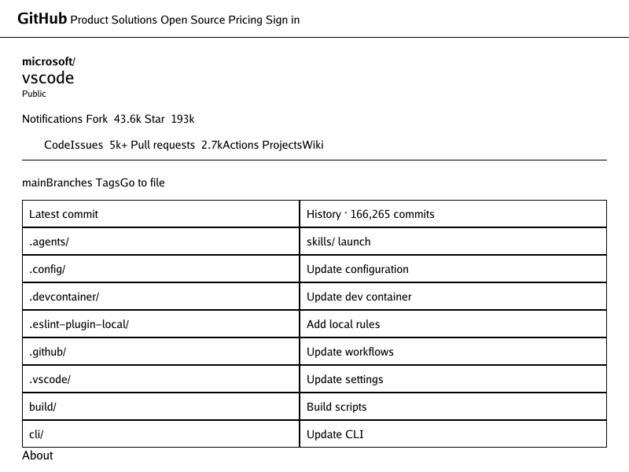

# GitHub repository-page baseline (structural stand-in)

This is a deterministic, offline **baseline, not a golden success** for the
public, logged-out `microsoft/vscode` repository page at an 800×600 viewport.
It is not a screenshot or faithful capture of GitHub. The checked-in fixture
is an authored, script-free stand-in assembled from a read-only public page
inspection; it provides representative repository header, tabs, file list,
and About landmarks while making the current renderer's limitations visible.



## Reproduce

From the repository root, with no network required:

```sh
go run ./cmd/simplebrowser -o /tmp/github-vscode-baseline.png testdata/github-vscode/index.html
```

The input is [`testdata/github-vscode/index.html`](../testdata/github-vscode/index.html).
The renderer's viewport is 800×600. Regenerate the committed diagnostic with
the same command and `-o docs/screenshots/github-vscode-baseline.png`.

## Source, scope, and asset notes

- Source inspected: `https://github.com/microsoft/vscode`, public logged-out
  HTML response, fetched 2026-09-27 UTC. This records a point-in-time page
  inspection, not a promise that live content remains unchanged.
- The page identified itself as “GitHub - microsoft/vscode: Visual Studio
  Code · GitHub”; its rendered text included the public badge, Code/Issues/
  Pull requests/Actions/Projects/Wiki navigation, the `main` branch, a
  166,265-commit count, repository file rows, and an About description.
- The response references GitHub-hosted stylesheets, scripts, icons/fonts and
  external README images (including shields and a signed user-image URL).
  They are intentionally not vendored or fetched by this fixture. Scripts,
  authentication state, user-generated media, external requests, and the
  rest of the page are excluded. The stand-in has no external asset requests
  and contains no copied image, font, stylesheet, script, credential, or
  browser cookie.
- The `microsoft/vscode` repository declares the MIT license for its project
  code; that does not grant a license to redistribute GitHub's HTML, CSS,
  brand assets, or the external images referenced by the live page. The
  fixture uses original markup and neutral, hand-authored CSS, with short
  repository labels and counts observed in the public response. GitHub's
  stylesheets and assets are not included.
- No real-browser screenshot or image comparison is checked in. A browser
  executable was not available in this checkout environment, and copying the
  live page's visual assets/styles was not necessary for this baseline. The
  PNG here is only the current simplebrowser output for the authored fixture.

## Inspected layout and evidence-backed gaps

The public response linked multiple stylesheets for GitHub/Primer and
repository/code views, with behavior scripts; the markup included responsive
navigation, button-like controls, repository navigation, a file table, inline
SVG/icon content, and README images. The hand-authored fixture makes the
observable layout dependencies explicit using `display:flex`, `gap`,
`align-items`, flexible sizing, a table, and CSS custom properties (`--...`
and `var(...)`). These are deliberately exercised rather than presented as
GitHub's original CSS.

The baseline PNG shows that the current renderer lays the fixture's flex
containers out as ordinary block flow and does not resolve its custom
properties. Thus the compact navigation/actions/columns do not retain their
authored horizontal arrangement or theme colors. The table and text are
visible; this is a diagnostic of the renderer, not parity evidence. No flex,
grid, or custom-property work is assumed complete based on other display
values or SVG-specific parsing.

Confirmed follow-ups are tracked separately:

- [#245 CSS custom properties in ordinary declarations](https://github.com/lukehoban/simplebrowser/issues/245)
  (tracked after this PR is opened).
- [#246 Flexbox row/column layout](https://github.com/lukehoban/simplebrowser/issues/246)
  (tracked after this PR is opened).

Grid is not used as a requirement in this stand-in; no grid issue is proposed
without a confirmed, isolated reproduction. Existing rendering limitations
remain tracked in [renderer follow-ups #154](https://github.com/lukehoban/simplebrowser/issues/154).
This milestone excludes JavaScript, logged-in/personalized UI, interactions,
responsive behavior beyond the single viewport, network fetching of page
assets, full repository/README content, and whole-page or pixel-perfect
GitHub parity.
