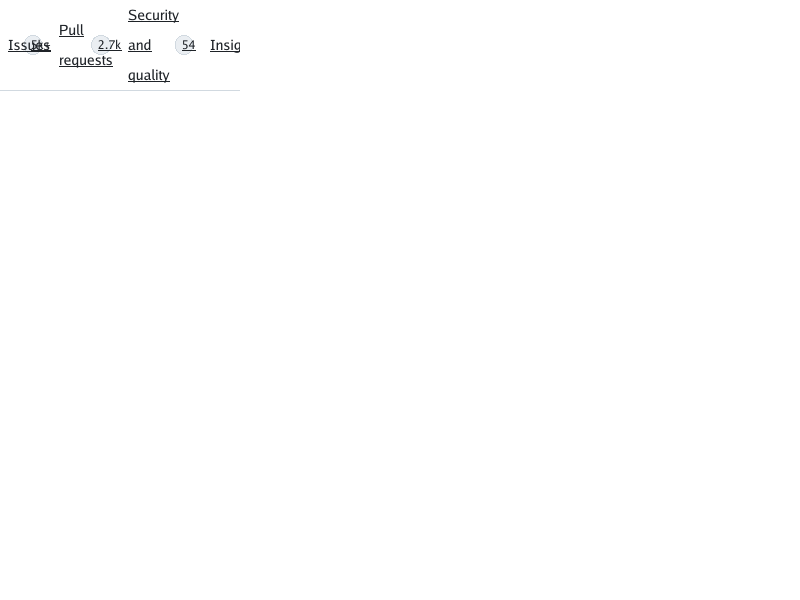
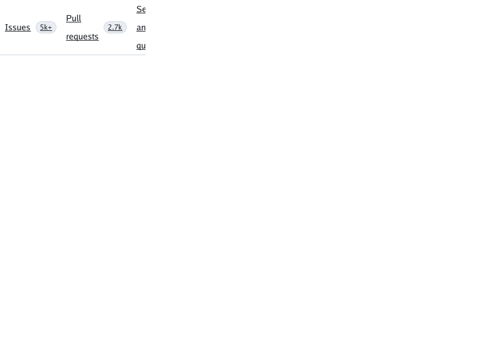

# GitHub repository count-badge overlap

Issue [#375](https://github.com/lukehoban/simplebrowser/issues/375) records
the visible overlap in the public, logged-out `microsoft/vscode` page. The
cause is general row-flex sizing, not a GitHub selector: the implementation
had treated `min-width:auto` as zero, allowing a flex item to shrink below its
min-content width while its text still painted at full width over the next
item. The adjacent count badge was also allowed to shrink to a few pixels.

The fix gives row flex items a content-based automatic minimum, except when
the item itself is a scroll container. An explicit `min-width`, including
`min-width:0`, replaces that automatic floor. This is a bounded min-content
rule: a definite specified `width` and `max-width` cap the automatic minimum,
with border-box sizes converted to content-box lengths. Transferred-size
suggestions and column-axis `min-height:auto` remain unsupported (see
[flexbox support](flexbox.md)).

## Deterministic reproduction

The local fixture keeps two labeled count tabs and additional navigation
items in a 240px-wide overflowing flex row:
[`testdata/github-vscode/repros/count-badge-overlap.html`](../testdata/github-vscode/repros/count-badge-overlap.html).
Render it from the repository root:

```sh
go run ./cmd/simplebrowser -o /tmp/count-badge-overlap.png \
  testdata/github-vscode/repros/count-badge-overlap.html
```

Before the fix, the measured Issues text run occupied `(8,30)-(51,60)` while
its count box had collapsed to `(31,36)-(35,54)`, producing an overlap of
`(31,36)-(35,54)`. The Pull requests word `requests` likewise intersected its
badge at `(98,45)-(104,54)`. With the fix, the Issues tab remains 101px wide:
its label box is `(8,30)-(51,60)` and its 20px count box is `(66,36)-(86,54)`,
leaving 15px between the label and badge. The regression test checks text-run
rectangles against each badge, and verifies that explicit `min-width:0` still
allows flex shrink.

| Before: the Issues text paints through its collapsed count | After: label and count occupy separate boxes |
| --- | --- |
|  |  |

These are deterministic 800×600 renders of the local fixture, not screenshots
of GitHub. The committed [live-page evidence](screenshots/live-github-330/simplebrowser-1b703413-2026-09-27.png)
and a fresh pre-fix 2026-09-27 render reproduce the real-page overlap. This
change addresses the shared min-content flex sizing primitive only; it does
not claim to resolve the separate filename, branch-control, or placeholder
gaps tracked from that live capture.
