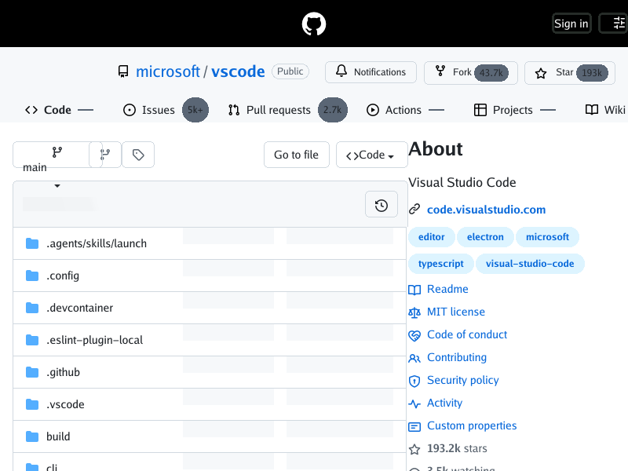

# Live GitHub vertical-flow reassessment (2026-09-28)

## Result

The large first-viewport vertical displacement tracked by [#349](https://github.com/lukehoban/simplebrowser/issues/349)
is no longer present on current `main` (`95cf34a`). A fresh direct,
logged-out render of `https://github.com/microsoft/vscode` at 800×600 places
the repository tabs at approximately y=120–160, the branch control at
approximately y=210, and the first file row at approximately y=304.



The earlier analysis on `f955ee4` measured tabs around y=375–415 and the
branch/file area beginning around y=450. The post-Cascade analysis on
`1b703413` measured wrapped tabs around y=160–232 and the first file row
around y=368. The current capture therefore removes the unexplained large
gap: the tabs are in the same first-viewport band as the prior Chrome
reference (approximately y=130–174), and the file list begins above the
Chrome reference's approximate y=334. Seven file rows are visible in the
current capture, rather than only the first two entering the viewport in the
original report.

This is a fresh diagnostic capture of changing production content. A
same-moment Chrome executable was not available in this environment, so the
comparison uses the clean-profile Chrome measurements recorded in the prior
live report. The CLI does not execute JavaScript, and this report does not
claim JavaScript-hydrated metadata parity.

## Reproduction and measurements

```sh
go run ./cmd/simplebrowser \
  -o docs/screenshots/live-github-349/simplebrowser-main-2026-09-28.png \
  https://github.com/microsoft/vscode
```

The PNG is 800×600 RGB with SHA-256
`11ab13db364e75566808f7c2332ce062b0ac2903d91a2f6116f785934431a225`.

| Region | Previous analysis (`f955ee4`) | Current `main` | Chrome reference |
| --- | ---: | ---: | ---: |
| Repository tabs | y=375–415 | y=120–160 | y=130–174 |
| Branch control | around y=450 | around y=210 | around y=200 |
| First file row | around y=450 | around y=304 | around y=334 |

The exact live response can change between captures. The current evidence
resolves #349 as an observed live-page outcome; it is not a pixel-parity
assertion or a replacement for the broader scope in [#330](https://github.com/lukehoban/simplebrowser/issues/330).

## Known gaps / follow-ups

- [#330](https://github.com/lukehoban/simplebrowser/issues/330) remains open
  for broader first-viewport acceptance and remaining renderer coverage.
- [#378](https://github.com/lukehoban/simplebrowser/issues/378) remains
  deferred pending the JavaScript-hydrated metadata scope decision.
- Remaining reusable renderer gaps are tracked by the linked open issues
  under [#330](https://github.com/lukehoban/simplebrowser/issues/330).

<!-- repo-agent-task:6192b6993d024092f1d1d6e8dead2f92 -->
