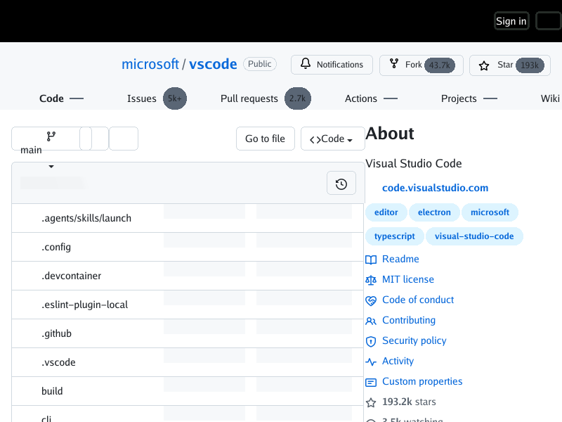

# Live GitHub appearance control after inline SVG merge

On main [`8c25da22`](https://github.com/lukehoban/simplebrowser/commit/8c25da22e9feb1323139aac11ca485d12bff1c41) (merge of #400), the exact-merge [CI run 36367798569](https://github.com/lukehoban/simplebrowser/actions/runs/36367798569) passed `test` and `render`. Reproduction from a public, logged-out request on 2026-09-27:

```sh
go run ./cmd/simplebrowser -o live.png https://github.com/microsoft/vscode
```

The PNG is 800×600. This is a diagnostic against a changing external response, **not** a deterministic CI golden or acceptance of #330/#351.



At x≈763–800, y≈16–43, the appearance button has its outline and the `Appearance settings` tooltip text is hidden, but **no slider glyph is visible** inside the button. The inspected public HTML response still contains `<svg class="octicon octicon-sliders" viewBox="0 0 16 16" width="16" height="16" fill="currentColor">` with a `<path>` inside the leading-visual span. `-image-boxes` on a second live request drew outlines around several other SVGs but no visible SVG outline within this top-right button. The two requests are not byte-pinned; these observations alone do not establish whether this is SVG color, layout, clipping, or document CSS.

For visual context, the earlier [clean-profile Chrome reference](screenshots/live-github-330/chrome-3588c1f-2026-09-27.png) shows a 16×16 slider glyph in its outlined top-right button. It is from an earlier dynamic GitHub response and is *not* a pixel-perfect comparison for other page content. The current CLI response shows branch/file content, while placeholder commit metadata (#378), other controls (#377), and differences in header flow persist. Keep #351 open pending a focused icon diagnosis and a successful live recapture; #398 (host CSS inside SVG) and #401 (vertical writing mode sizing) remain separate.
