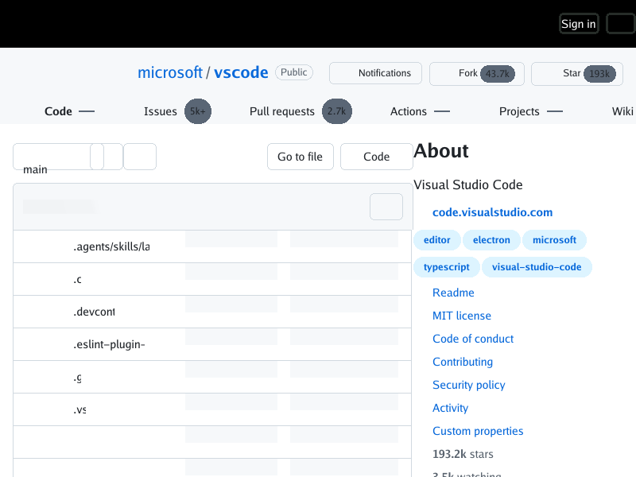
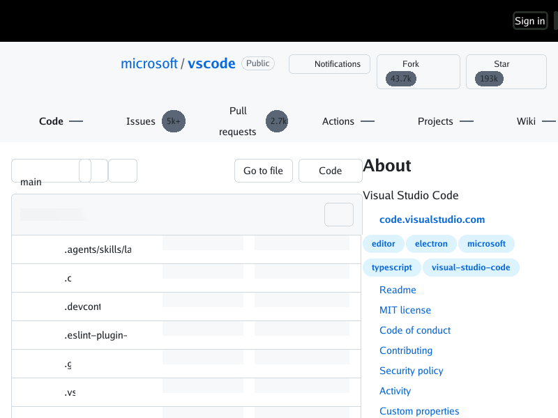
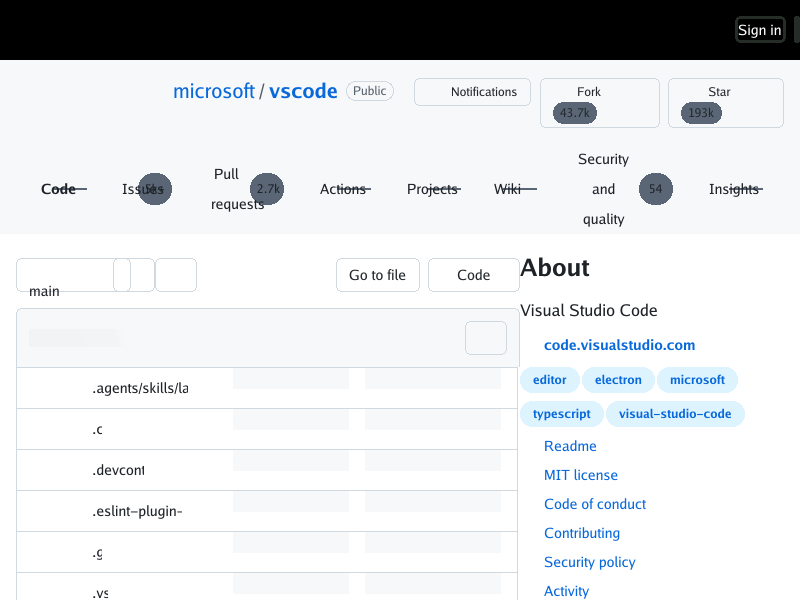
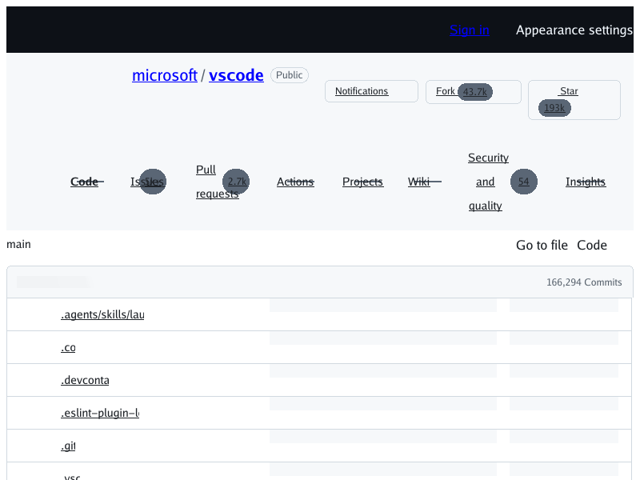
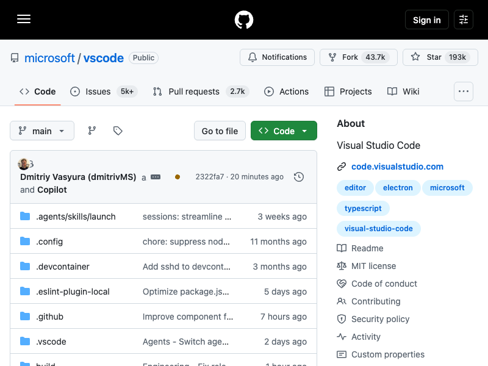
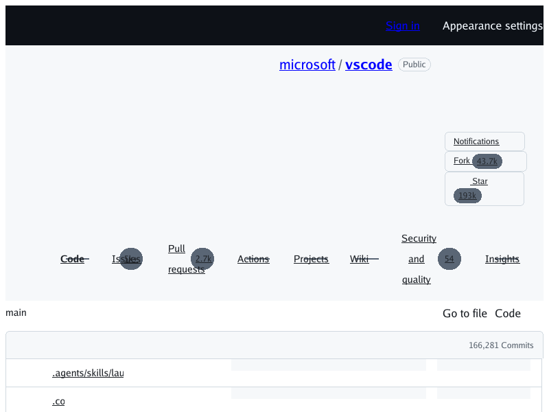

# Live GitHub first-viewport check (2026-09-27)

## Appearance-control sizing check on `6bb9df2`

This fresh 800×600 public, logged-out `microsoft/vscode` capture renders
[`6bb9df2`](https://github.com/lukehoban/simplebrowser/commit/6bb9df2), which
maps the horizontal-writing-mode `inline-size` property to the used width.



The appearance trigger now reserves its outlined control box beside
**Sign in** rather than collapsing to zero width. The slider glyph is still
absent because HTML inline-SVG painting is tracked separately in
[#390](https://github.com/lukehoban/simplebrowser/issues/390); the tooltip
remains hidden. This capture verifies sizing only and does not establish the
expected icon-only appearance control in [#351](https://github.com/lukehoban/simplebrowser/issues/351).

CLI command:
`go run ./cmd/simplebrowser -o docs/screenshots/live-github-330/simplebrowser-issue351-logical-size-6bb9df2-2026-09-27.png https://github.com/microsoft/vscode`.
The PNG is 800×600 RGB with SHA-256
`358f2f9d0c898bf7c701874493e5184f18dc4e691fc64589a5103ff079927008`.

## Post-row-flex recheck on `main` `1478bb5` (23:52 UTC)

This fresh 800×600 capture renders the public, logged-out
`https://github.com/microsoft/vscode` response from merge commit
[`1478bb5d2522924f55d4f8770d58e21feca4adb3`](https://github.com/lukehoban/simplebrowser/commit/1478bb5d2522924f55d4f8770d58e21feca4adb3),
after the row-flex automatic minimum-size fix landed in
[#379](https://github.com/lukehoban/simplebrowser/pull/379). The CLI does not
execute JavaScript.



The tab labels and adjacent count badges now occupy separate space. The thin
empty-count lines that crossed labels in the previous capture are instead
painted to the right of **Code**, **Actions**, **Projects**, and **Wiki**;
**Issues** and **Pull requests** counts no longer cover their labels. This is
fresh live confirmation for [#374](https://github.com/lukehoban/simplebrowser/issues/374)
and complements the deterministic before/after fixture for
[#375](https://github.com/lukehoban/simplebrowser/issues/375).

The capture still shows the separately tracked clipped file names, empty branch
controls, and grey commit-message placeholders. It remains changing production
content and is diagnostic evidence, not a golden or a claim of pixel parity.

CLI command:
`go run ./cmd/simplebrowser -o /tmp/github-live-1478bb5.png https://github.com/microsoft/vscode`.
The PNG is 800×600 RGB with SHA-256
`72bf2b8b7fe6e2d66e232799e44f84913742939abb82a2283251ab2cc46625db`.


## Post-Cascade-Layers recheck on `main` `1b703413` (23:10 UTC)

This fresh 800×600 capture renders the public, logged-out
`https://github.com/microsoft/vscode` response from merge commit
[`1b703413e8eaab9d0db16186db962ce97d04d8ef`](https://github.com/lukehoban/simplebrowser/commit/1b703413e8eaab9d0db16186db962ce97d04d8ef),
after CSS Cascade Layers landed in
[#364](https://github.com/lukehoban/simplebrowser/pull/364). The CLI does not
execute JavaScript.



The former 8px white outer inset is gone: the black header reaches the top,
left, and right viewport edges, resolving the observed behavior in
[#350](https://github.com/lukehoban/simplebrowser/issues/350). The persistent
“Appearance settings” tooltip text is also absent, but the expected compact
appearance icon is not clearly visible at the right edge, so
[#351](https://github.com/lukehoban/simplebrowser/issues/351) remains open.

Repository identity, tabs, controls, file rows, and the About sidebar are
visible. The tabs still wrap over roughly y=160–232 and the first file row
begins around y=368, so this capture does not establish the broader first-
viewport acceptance for [#330](https://github.com/lukehoban/simplebrowser/issues/330).
The page is changing production content and no same-moment Chrome reference was
captured; this is diagnostic evidence, not a golden or parity assertion.

CLI command:
`go run ./cmd/simplebrowser -o docs/screenshots/live-github-330/simplebrowser-1b703413-2026-09-27.png https://github.com/microsoft/vscode`.
The PNG is 800×600 RGB with SHA-256
`71743cbf525e2e0577acf2a61d4677f702f15038f712156d8f563aad7a883d8f`.

## Fresh recheck on `main` `3588c1f` (21:36 UTC)

These paired 800×600 captures show the public, logged-out
`https://github.com/microsoft/vscode` page on 2026-09-27. The CLI used source
commit [`3588c1f572c18a56e5d4bb61607ff65f88d53b54`](https://github.com/lukehoban/simplebrowser/commit/3588c1f572c18a56e5d4bb61607ff65f88d53b54)
and did not execute JavaScript. Chrome 154.0.8037.58 used a fresh temporary
profile and normal JavaScript.

| simplebrowser CLI (no JavaScript) | Clean-profile Chrome (JavaScript on) |
| --- | --- |
|  |  |

**Result: acceptance is not established.** The CLI shows the repository
identity at approximately y=94, but its tabs wrap and occupy about y=190–265;
branch/file controls are near y=300 and the first directory row begins around
y=373. Chrome places the tabs around y=130–175, controls near y=200, its latest
commit card at y=247–333, and the first directory row around y=334. Thus the
tabs remain substantially lower in the CLI, while the first directory row is
about 39px lower; the CLI shows about five full rows and part of a sixth,
versus six full rows and part of a seventh in Chrome. The CLI capture visibly
has an approximately 8px white outer inset and the persistent “Appearance
settings” label. These observations support the already-open
[#349](https://github.com/lukehoban/simplebrowser/issues/349),
[#350](https://github.com/lukehoban/simplebrowser/issues/350), and
[#351](https://github.com/lukehoban/simplebrowser/issues/351); no additional
visual discrepancy merits a new issue.

The previous nearly blank overlay regression
[#352](https://github.com/lukehoban/simplebrowser/issues/352) is gone. The
repository identity and rows are visible, but their vertical flow and the
header presentation do not yet broadly preserve Chrome's first viewport; keep
#330 open. The deterministic offline fixture
[#242](https://github.com/lukehoban/simplebrowser/issues/242) remains separate.

CLI command: `go run ./cmd/simplebrowser -o
docs/screenshots/live-github-330/simplebrowser-3588c1f-2026-09-27.png
https://github.com/microsoft/vscode`, started 21:36:02 UTC and finished
21:36:14 UTC; SHA-256
`5a350a0e9dd1903eed229bba5c2b892344287498db78e3cb66f202a13f7dc202`.
Chrome capture: clean-profile headless Chrome at 800×600, device scale factor 1,
with normal JavaScript; started 21:36:14 UTC and captured at 21:36:16 UTC;
SHA-256
`d49d7994062731a98bf8eec7e7c69084b95fca2b12fdfe7f43f43051b6ca126e`.
For this reference, the page reached `document.readyState=complete`, 32
stylesheet objects were present (26 stylesheet responses were HTTP 200, with
zero network failures in the capture session), the computed body margin was
0, navigation links were not underlined, and the hidden appearance tooltip
was not displayed before screenshot capture. This excludes the earlier
under-styled Chrome attempt from the comparison. Both PNGs are 800×600 RGB.
The Chrome reference is a practical comparison, not a JS-off pixel-parity
oracle. No raw response was committed.

## Historical regression evidence (before opacity and float fixes)

These are public, logged-out 800×600 captures of `https://github.com/microsoft/vscode`.
The renderer fetches and renders the live page without running JavaScript. The
reference is Google Chrome 154.0.8037.58 in headless mode, using a fresh
temporary profile with no cookies or signed-in state. Chrome ran with its
normal JavaScript behavior, so this is a practical visual comparison, not a
controlled script-on/script-off pixel test.

| `simplebrowser` on current `main` `f955ee4` — **nearly blank (regression)** | `simplebrowser` on previous `main` `9976c151` | Logged-out Chrome reference |
| --- | --- | --- |
|  |  |  |

## Result

**No, not on then-current `main`.** At `f955ee437098646457612cb2c0d43de15f13e002`
the renderer's capture is a failed, nearly blank render. It shows a dark
viewport with only **Sign in** and **Appearance settings** at the top right.
It shows no repository identity, tabs, branch/file controls or file rows, so it
is not evidence of vertical flow or layout. This is a regression tracked in
[#352](https://github.com/lukehoban/simplebrowser/issues/352). Rendering the
same live page in the same minute with previous `main` (`9976c151`) still shows
repository content. Bisecting the #332 merge points to `e7bfd2c`, the merge of
`main` into the #332 integration branch. The root cause has not been diagnosed.

The `9976c151` capture is the latest evidence that a JavaScript-free render can
identify the repository. It shows `microsoft / vscode`, a **Public** badge,
Notifications/Fork/Star buttons, the repository tabs (Code, Issues, Pull
requests, Actions, Projects, Wiki, Security and quality, Insights), `main`, Go
to file, Code, a commit count, and the first two file rows (`.agents/skills/lau…`
and `.co…`). In that capture the tabs sit around y=340–410 and the file list
starts around y=480. In the Chrome reference, the tabs are around y=130–174,
the branch controls around y=200, and seven file rows are visible. Remaining
differences in that older capture are tracked in
[#349](https://github.com/lukehoban/simplebrowser/issues/349) (vertical
displacement), [#350](https://github.com/lukehoban/simplebrowser/issues/350)
(8px white inset) and
[#351](https://github.com/lukehoban/simplebrowser/issues/351) (appearance
tooltip). These screenshots alone do not diagnose any CSS cause.

The fixed-viewport inventory of the *offline stand-in* is tracked separately in
[#298](https://github.com/lukehoban/simplebrowser/issues/298). It is not a
diagnosis of the live response.

GitHub is variable production content, and Chrome may hydrate content or load
resources differently. These screenshots are diagnostics, not a golden or a CI
parity assertion. Authentication, JavaScript interaction, whole-page and
responsive fidelity remain out of scope for this milestone.

## Capture and resource notes

Both renderer captures used the same command from a checkout of the commit
named in the table:

```sh
go run ./cmd/simplebrowser \
  -o /tmp/live-github.png https://github.com/microsoft/vscode
```

The `f955ee4` capture reproduced byte-for-byte at about 20:37, 20:50 and
20:53 UTC on 2026-09-27. The `9976c151` capture was taken at about 20:53 UTC.
The Chrome reference was captured around 20:37–20:38 UTC. It used headless
mode, an 800×600 window, device scale factor 1, hidden scrollbars, disabled
extensions and an empty temporary user-data directory. Chrome's JavaScript was
not disabled. All three PNGs are 800×600 RGB images. Their SHA-256 values are:

- `cd5641f4c199d683dfae4c6582d7d6de5939101344d211336be2a27ad5c2115d` (`simplebrowser`, `f955ee4`)
- `b6e8d012db74cd83b2c0ff111f2f07f18c180c8261096f1c7c83be609c4c1212` (`simplebrowser`, `9976c151`)
- `025e90f97edafefb8b58dadaa7b0e8010b98330bad7a9cf947c98e2680d11567` (Chrome)

During the ~20:37 UTC check, a separate in-memory read of the public HTML returned HTTP 200 and 383,917
bytes. It referenced 41 stylesheet links in total: 27 active `href` links (23
unique stylesheet URLs) and 14 deferred theme `data-href` links. It also
referenced 10 external script URLs and 3 image `src` URLs. These are document
reference counts, not a claim that every resource loaded successfully; the CLI
does not emit a per-request trace. The scripts are deliberately neither
executed nor fetched by the renderer. The response was not saved, and no
cookies, credentials or raw response content are included here.

<!-- repo-agent-task:simplebrowser-issue330-live-js-free-milestone-check-9976c151-v1 -->
<!-- repo-agent-task:6694d5f38f0a7e19cc80f31a0c9ecc82 -->
<!-- repo-agent-task:simplebrowser-pr348-current-screenshot-evidence-reconciliation-9adaef6-v1 -->
<!-- repo-agent-task:db8cabf6bd8029c25a472b612065934c -->
