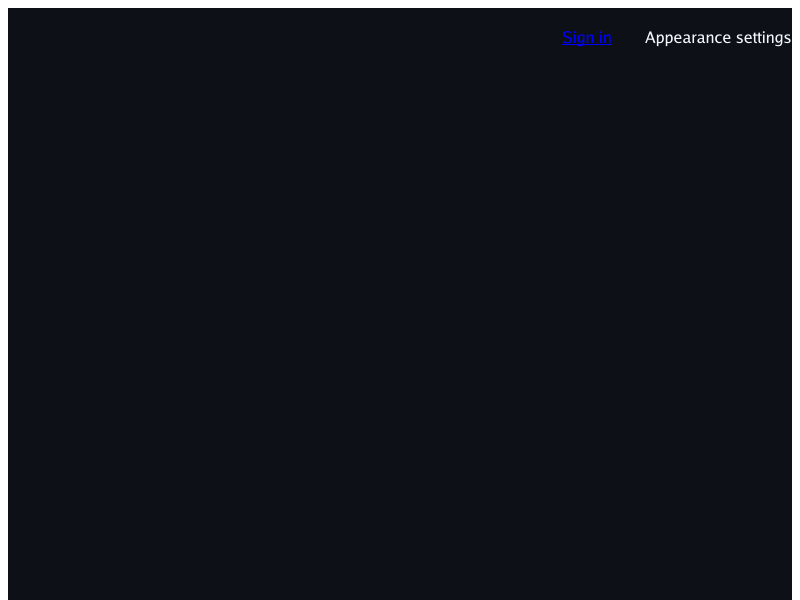
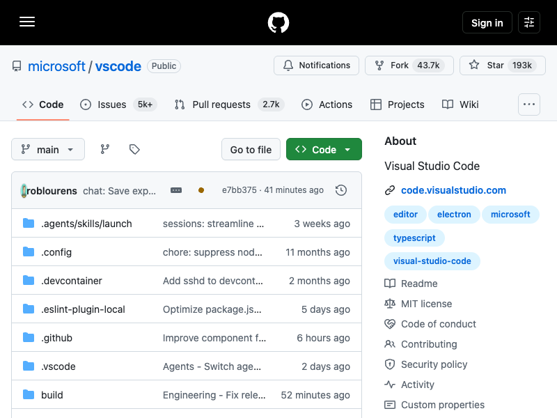

# Live GitHub first-viewport check (2026-09-27)

Fresh public, logged-out captures of `https://github.com/microsoft/vscode` at
800×600, refreshed 2026-09-27 around 20:37–20:38 UTC after merging
`f955ee437098646457612cb2c0d43de15f13e002`. The renderer fetches and
renders the live page without executing JavaScript; the reference is Google
Chrome 154.0.8037.58 in headless mode with a fresh temporary profile and no
cookies or signed-in state. Chrome has its normal JavaScript behavior enabled,
so the two captures are a practical visual comparison, not a controlled
script-on/script-off pixel test.

| Current `simplebrowser` CLI (no JavaScript) | Current logged-out Chrome reference |
| --- | --- |
|  |  |

## Result

**Yes, but only minimally:** without running JavaScript, the renderer shows the
`microsoft / vscode` repository identity, repository tabs, branch/commit
controls and the beginnings of the file list. The expanded marketing menu and
hidden/template text that previously obscured the page are not present in this
capture. This is enough to identify the repository and see that it has file
rows, but it is not yet a broadly useful or faithful first viewport.

The refreshed live CLI image differs substantially from the same-time Chrome
reference: the tabs sit around y=340–400 rather than y=130–174, and the
branch/file area starts around y=450, with only the first two rows entering the
600px viewport; Chrome shows the branch controls around y=200 and about six
directory rows. Generated-content support now present on `main` does not erase
that bounded result: visible labels and count badges render, while the major
vertical displacement remains. This is observed live-page vertical-flow/layout
drift, not a diagnosis of its CSS cause or a claim that generated content caused
the difference from the earlier capture. The corresponding fixed-viewport
*offline stand-in* inventory is tracked separately in
[#298](https://github.com/lukehoban/simplebrowser/issues/298); its findings must
not be treated as a live-response diagnosis. Do not infer that a particular
layout feature is missing from these screenshots alone.

The page is variable production content, and Chrome may hydrate content or
load resources differently. The screenshots are diagnostics, not a golden or
CI parity assertion. Authentication, JavaScript interaction, whole-page and
responsive fidelity remain out of scope for this milestone.

## Capture and resource notes

The CLI capture was produced from the checkout's current `main` code using:

```sh
go run ./cmd/simplebrowser \
  -o /tmp/live-github.png https://github.com/microsoft/vscode
```

The reference used Google Chrome 154.0.8037.58, headless, 800×600 window size,
device scale factor 1, hidden scrollbars, disabled extensions, and an empty
temporary user-data directory. Chrome's JavaScript was not disabled. Both
saved PNGs are 800×600 RGB images; their SHA-256 values are
`cd5641f4c199d683dfae4c6582d7d6de5939101344d211336be2a27ad5c2115d`
(`simplebrowser`) and
`025e90f97edafefb8b58dadaa7b0e8010b98330bad7a9cf947c98e2680d11567`
(`Chrome`).

A separate in-memory read of the public HTML returned HTTP 200 and 383,917
bytes. It referenced 41 stylesheet links (23 unique stylesheet URLs), 10
external script URLs, 3 image `src` URLs and 14 deferred theme `data-href`
links. These are document reference counts, not a claim that every resource
loaded successfully; the CLI does not emit a per-request trace. The scripts
are deliberately neither executed nor fetched by the renderer. The response
was not saved, and no cookies, credentials or raw response content are included
here.

<!-- repo-agent-task:simplebrowser-issue330-live-js-free-milestone-check-9976c151-v1 -->
<!-- repo-agent-task:6694d5f38f0a7e19cc80f31a0c9ecc82 -->
