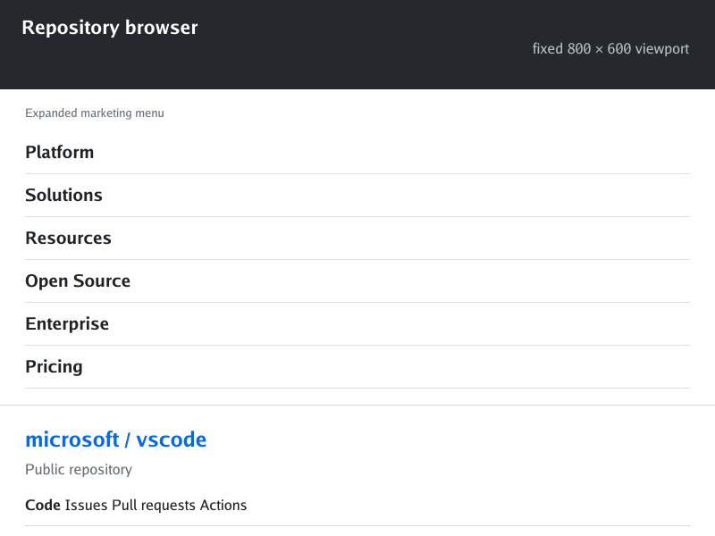
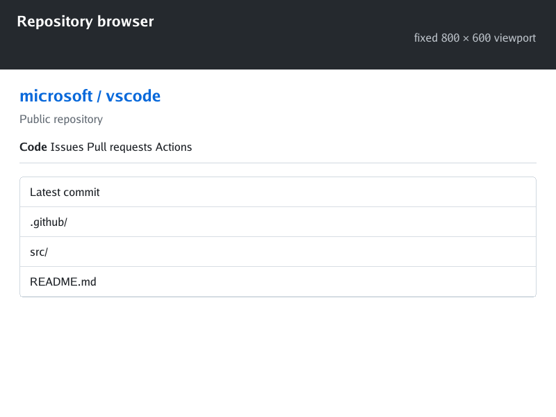

# Deterministic GitHub media-range repro (#334)

The screenshots below render the same checked-in, offline 800×600 fixture.
They isolate the compact media query that motivated #334:
`@media (width<=1011.98px)`. The fixture uses a small authored repository-page
stand-in; it does not copy GitHub HTML, CSS, assets, or a changing live
response.

| Before (main `9151177`, range ignored) | After (#334, range matched) |
| --- | --- |
|  |  |

The before image visibly contains all six menu entries—Platform, Solutions,
Resources, Open Source, Enterprise, and Pricing—and only the top of the
repository content fits in the viewport. The after image contains no marketing
menu; `microsoft / vscode`, its navigation, and four file rows are visible in the file list, whose
corners are rounded by the border-radius support already on main.
This verifies the direction of the comparison as well as the changed pixels.

## Reproduce

The input is
[`testdata/media-range-github/index.html`](../testdata/media-range-github/index.html).
It has no network requests. Render the after image from the PR checkout:

```sh
go run ./cmd/simplebrowser \
  -o docs/screenshots/media-range/github-after.png \
  testdata/media-range-github/index.html
```

To recreate the before image, export main `9151177` to a temporary directory,
copy in the same fixture (which is introduced by this PR), and render it with
that revision's browser:

```sh
tmp="$(mktemp -d)"
git archive 9151177 | tar -x -C "$tmp"
mkdir -p "$tmp/testdata/media-range-github"
cp testdata/media-range-github/index.html \
  "$tmp/testdata/media-range-github/index.html"
(cd "$tmp" && go run ./cmd/simplebrowser \
  -o before.png testdata/media-range-github/index.html)
cp "$tmp/before.png" docs/screenshots/media-range/github-before.png
```

For the committed captures, SHA-256 is
`9b8838d45b02e9a610f6790efeeca5f9f37e2299d3493cbc2269fe4ebbe8ea96`
for `github-before.png` and
`dad805ed4c69d4ccc535ff723cdf87aa55bc5a59ecdcb5f24f3ba3b4f0ca0272`
for `github-after.png`. Both are RGB PNGs measuring 800×600. The before capture is byte-identical
when rendered from the earlier main `89902d2`.

This focused evidence only demonstrates range-query evaluation. The broader
deterministic GitHub baseline and remaining renderer gaps stay tracked by
#330.
