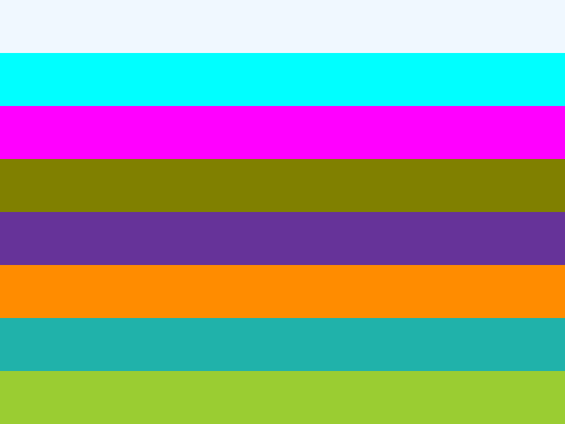

# Standard CSS named colors

Issue [#190](https://github.com/lukehoban/simplebrowser/issues/190) expands
color parsing from a small legacy subset to all 148 standard CSS named colors,
plus the special `transparent` keyword.

| Before | After |
| --- | --- |
|  |  |

The lookup is ASCII case-insensitive after CSS identifier escape decoding.
Standard aliases such as `aqua`/`cyan`, `fuchsia`/`magenta`, and the
`gray`/`grey` spellings resolve to identical sRGB values. `rebeccapurple`,
added by CSS Color 4, is included alongside the 147 SVG/CSS Color 3 names.

The invalid-color cascade and escaped-identifier regressions remain covered by
the tests introduced for [#181](https://github.com/lukehoban/simplebrowser/issues/181).
Refresh the visual with:

```sh
go run ./cmd/simplebrowser -o docs/screenshots/named-colors-after.png \
  testdata/css/named-colors.html
go test ./internal/browser -run 'Test(StandardNamedColor|ColorKeyword|InvalidColor)'
```

Color functions beyond the existing `rgb()`/`rgba()` support and SVG
`currentColor` remain outside this change; `currentColor` is tracked in
[#150](https://github.com/lukehoban/simplebrowser/issues/150).
