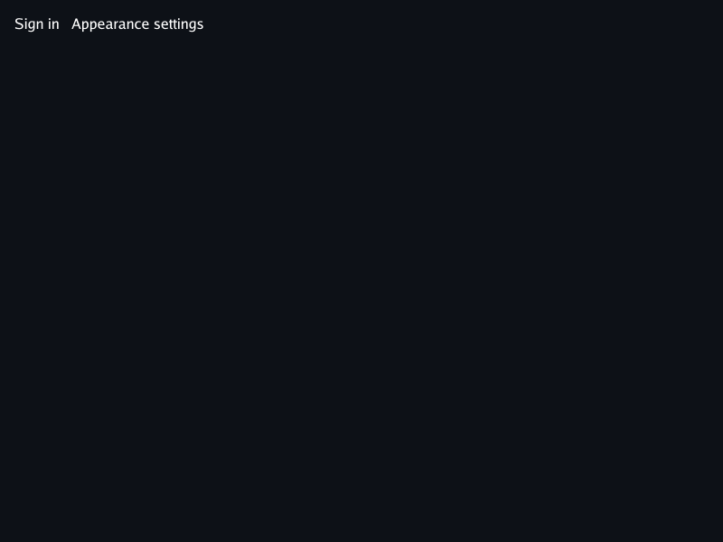
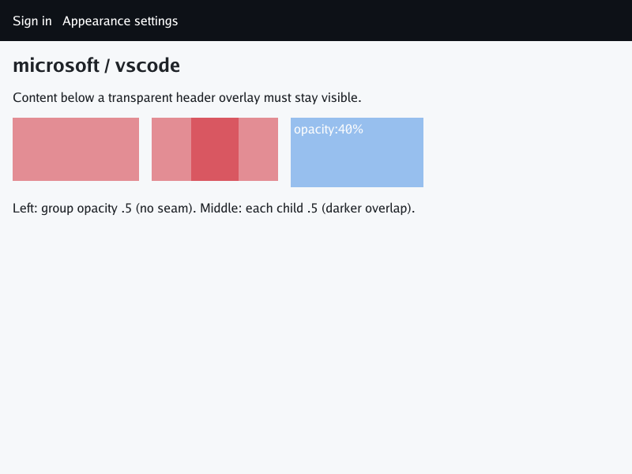
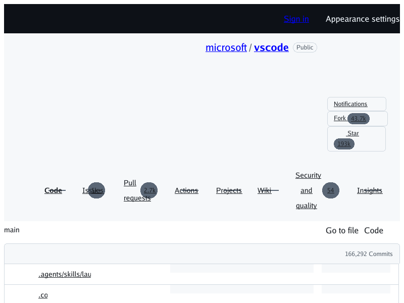
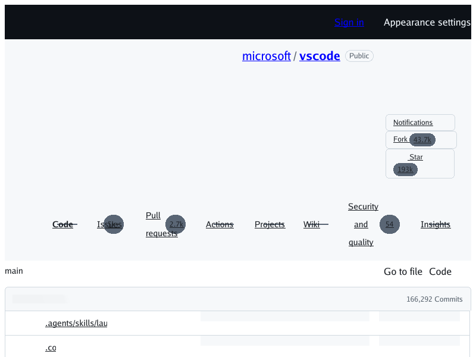

# Opacity (#352)

HTML `opacity` is painted by [`internal/browser/opacity.go`](../internal/browser/opacity.go).
It accepts a number or a percentage, and out-of-range values are clamped to [0, 1].
- An element with opacity below 1 forms a stacking context. If it is not positioned, it paints in the z-index 0 layer (CSS 2.1 Appendix E).
- The element and all of its descendants, including positioned ones, are painted into an offscreen layer. That layer is then composited once at the element's opacity, so overlapping children leave no seam.
- `opacity:0` paints nothing but keeps its layout.
- `@supports (opacity: …)` now matches.

## Why: the live GitHub regression

The logged-out GitHub header has an overlay rule:
`@media (width<=1011.98px){.HeaderMktg.header-logged-out:before{content:"";opacity:0;position:absolute;width:100%;height:100%;…}}`.
It only took effect once two changes had merged: `::before` generation (#312) and media range queries (#334). Before this fix opacity was ignored, so the overlay painted as an opaque dark rectangle over the whole 800×600 viewport.

Authored offline repro ([`testdata/opacity/index.html`](../testdata/opacity/index.html), no network):

| Before (main `f955ee4`) | After |
| --- | --- |
|  |  |

Live `https://github.com/microsoft/vscode` at 800×600. All three were captured in the same minute, 2026-09-27 21:04Z:

| Main `f955ee4` | Previous main `9976c151` | After |
| --- | --- | --- |
|  |  |  |

The live page changes over time (commit counts, markup, CSS hashes), so the live captures are evidence, not goldens. In this capture, the "after" image differs from previous main in exactly one area: 1,427 pixels inside (21,495)–(118,510). That area is the latest-commit skeleton bar, which is drawn by generated content (#312). Only the repro and the unit tests in `opacity_test.go` are deterministic.

To regenerate the repro:

```sh
go run ./cmd/simplebrowser -o docs/screenshots/opacity/repro-after.png testdata/opacity/index.html
```

SHA-256 of the committed files:
- `repro-before.png`: `7f490967…8617b2`
- `repro-after.png`: `d72f9680…0e503`
- `live-main-f955ee4.png`: `cd5641f4…115d` (byte-identical to the #352 report)
