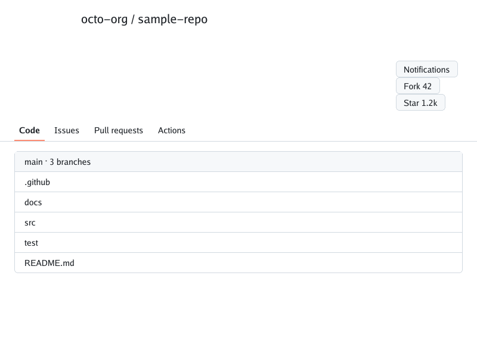
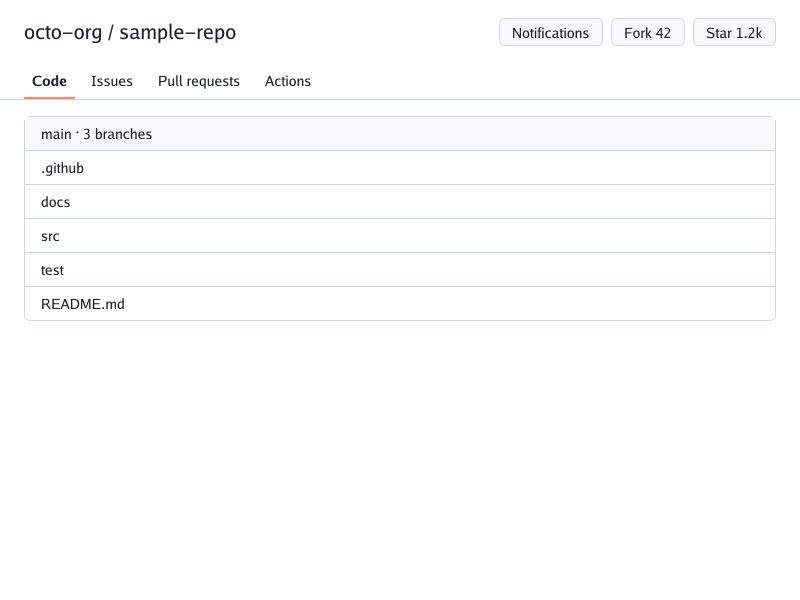

# Floats in flex items and shrink-to-fit widths (#349)

The live GitHub repository header puts its Notifications / Fork / Star
buttons in floated `li` elements inside a flex item. Two float bugs stacked
those buttons vertically and pushed the tabs and file list far down the
800×600 viewport:

1. **Max-content width ignored side-by-side floats.** Intrinsic sizing treated
   each (blockified) float like a stacked block, so a shrink-to-fit container
   was only as wide as its widest float and the floats wrapped onto separate
   lines. Consecutive floats now add to the current line's max-content width;
   a clearing float starts a new line.
2. **Flex items did not establish a formatting context.** A flex item's floats
   escaped into the shared float context, so the item did not contain them
   and the stretch re-layout placed them below their own first-pass copy.
   Flex items are now independent formatting roots (css-flexbox §4).

The fixture is authored for this repro and contains no GitHub HTML, CSS or
assets.

| Before (main `f955ee4`) | After | Chrome 154 |
| --- | --- | --- |
|  |  |  |

The same change also aligns the Wikipedia Moon header's search icon with its
links in the diagnostic baseline (top: before, bottom: after):


## Reproduce

```sh
go run ./cmd/simplebrowser -o docs/screenshots/pagehead-floats/after.png \
  testdata/pagehead-floats/index.html
```

The before image is the same command run from main `f955ee4`. The Chrome image
is a headless Chrome 154 capture at 800×600, device scale factor 1.

## Live GitHub measurements

On the public logged-out `https://github.com/microsoft/vscode` response of
2026-09-27 (live content changes), the repository header row shrank from
218px to 68px tall and the first file row moved from y≈483 to y≈333. The live
capture is still obscured by an `opacity:0` header overlay (#353); remaining
differences are tracked on #349.
