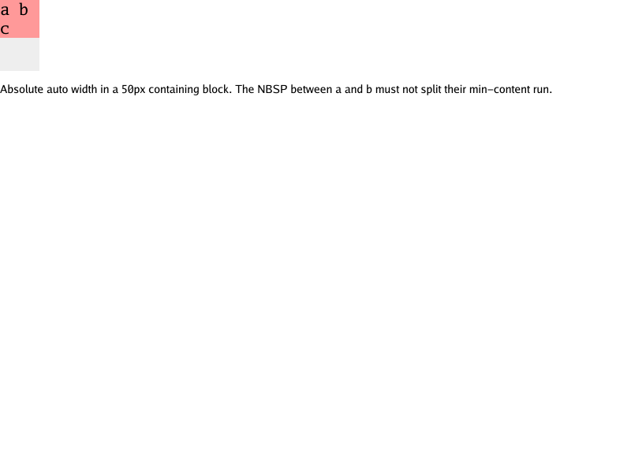
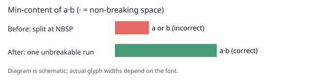

# Positioned NBSP intrinsic-width regression (#290)

The offline [repro fixture](../testdata/positioned-nbsp/index.html) contains an
auto-width absolute box with `a&nbsp;b c`. Its first word must be measured as
one unbreakable min-content run, not two separate letters. Ordinary spaces
still separate runs. The focused geometry and pixel tests live in
[`positioned_nbsp_test.go`](../internal/browser/positioned_nbsp_test.go).

| Before | After |
| :---: | :---: |
|  |  |

The rendered before/after PNGs are intentionally **pixel-identical**. The
existing outer shrink-to-fit clamp to available width masks the incorrect
min-content width for this case; the source-level min-content test is what
detects the fix. The diagram below shows the measurement difference, not a
claim of a changed screenshot.

