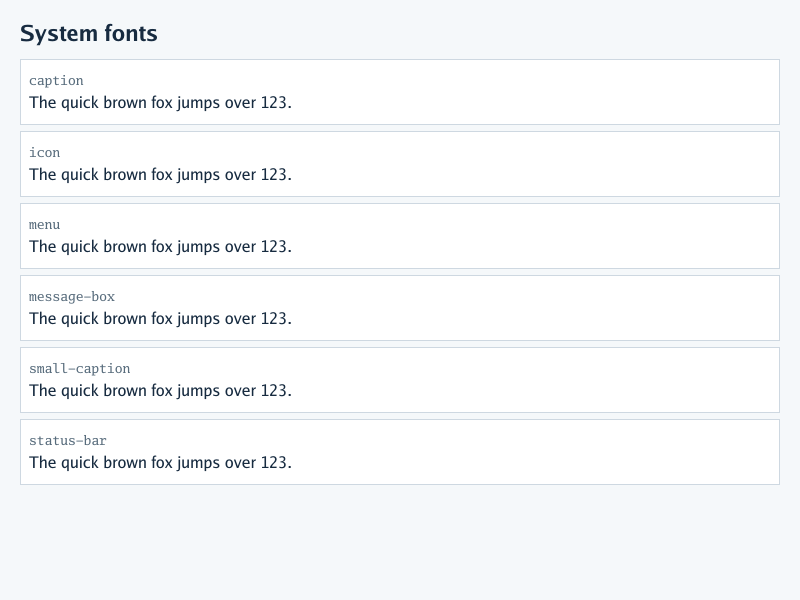
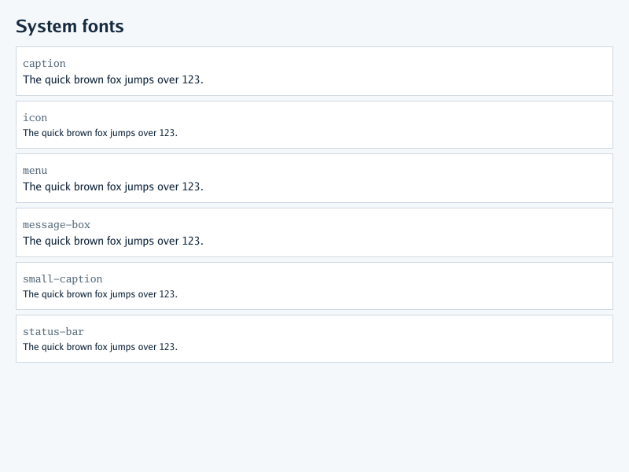

# CSS system-font shorthand preview

The renderer maps all six CSS system-font keywords to its bundled Go Sans
face, with regular weight and style and normal line-height. Fixed sizes are
`14px` for `caption`, `menu`, and `message-box`, and `12px` for `icon`,
`small-caption`, and `status-bar`. These are deterministic renderer choices,
not host OS font metrics. The `font` shorthand still resets the supported
font longhands and follows ordinary cascade precedence.

The offline fixture is [`testdata/system-fonts.html`](../testdata/system-fonts.html).
Both images use its exact markup at the default viewport. **Before** is
rendered from the parent revision of this change, where the declarations
were ignored; **after** is rendered with the keyword mapping enabled.

| Before | After |
| --- | --- |
|  |  |
