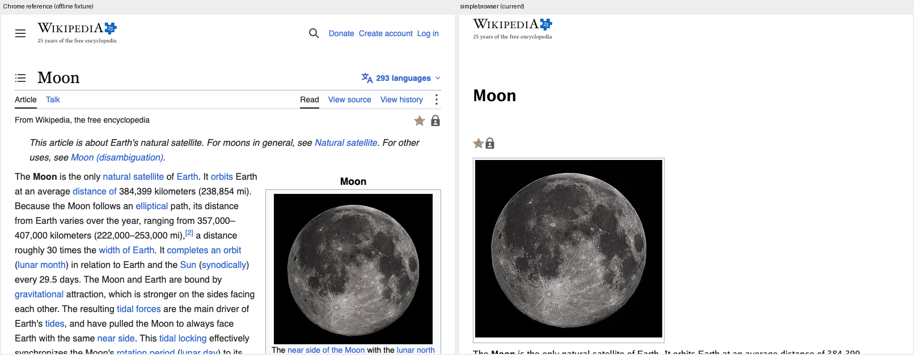

# Wikipedia Moon: 800×600 offline baseline (#245)

Evidence for the first [Wikipedia epic (#243)](https://github.com/lukehoban/simplebrowser/issues/243)
milestone: a deterministic, static, above-the-fold render of the default-skin
[Moon](https://en.wikipedia.org/wiki/Moon) article. Fixture, provenance and
licenses: [`testdata/wikipedia-moon/`](../testdata/wikipedia-moon/README.md).



- **Reference (left):** [`chrome-reference.png`](screenshots/wikipedia-moon/chrome-reference.png).
  Headless Chrome 154 on macOS renders the same offline fixture served over
  local HTTP at 800×600, device scale 1. macOS font substitution:
  `sans-serif` → Helvetica, and `"Linux Libertine", Georgia, …` → Georgia.
  Only a 70×18 px header area, where live JavaScript adds a reading-list icon,
  differs from a live capture of the page.
- **Baseline (right):** [`baseline.png`](screenshots/wikipedia-moon/baseline.png)
  is today's output. It is a **non-blocking record, not a golden**: CI renders
  it as a `render` job artifact but never compares it. Refresh it with
  `make moon-baseline` when the renderer changes.

Reproduce offline from a clean checkout:

```sh
go run ./cmd/simplebrowser -o moon.png testdata/wikipedia-moon/moon.html
```

`TestMoonFixtureIsOffline` checks that every stylesheet, image and CSS `url()`
resolves to a committed file and that the page has no scripts.

## What the view actually uses

Chrome computed styles for elements that intersect the 800×600 viewport:

| Feature | Observed above the fold | Current renderer |
|---|---|---|
| `@media` | Vector and TemplateStyles rules (the infobox float sits in `@media (min-width:640px)`; some print rules hide screen UI) | broken nesting; later rules leak unconditionally → [#250](https://github.com/lukehoban/simplebrowser/issues/250) |
| `@supports` | icon `mask-image` vs `background-image` fallback, `round()` image width | not evaluated → [#251](https://github.com/lukehoban/simplebrowser/issues/251) |
| Flexbox | header, logo, user links, title bar, tab toolbar, indicators, dropdown buttons (36 flex and 9 inline-flex boxes) | [#247](https://github.com/lukehoban/simplebrowser/issues/247) (shared with #242) |
| Floats | infobox `right`, language button `right`, indicators `right`, logo `left` | not placed → [#252](https://github.com/lukehoban/simplebrowser/issues/252); `clear` → [#68](https://github.com/lukehoban/simplebrowser/issues/68) |
| Custom properties | 134 `var()` uses: link colors, font sizes, borders, image size | [#246](https://github.com/lukehoban/simplebrowser/issues/246) (shared with #242) |
| `calc()` | image width, spacing, media conditions | [#254](https://github.com/lukehoban/simplebrowser/issues/254) |
| `overflow:hidden` / `clip` | hidden skip link, dropdown label text | not clipped → [#253](https://github.com/lukehoban/simplebrowser/issues/253) |
| Fonts | title in `"Linux Libertine", Georgia, …, serif` at 28.8px; body `sans-serif` 14–17.6px | serif → [#87](https://github.com/lukehoban/simplebrowser/issues/87); Arial/Helvetica metrics → [#120](https://github.com/lukehoban/simplebrowser/issues/120) |
| Images / `srcset` | five visible images (wordmark, tagline, two indicators, 280×266 Moon photo); each thumbnail has a `2x` `srcset` candidate | the 1× `src` is right at device scale 1; `srcset` is not needed for this view |
| Grid | only inside `@media (min-width:1120px)` and larger | not used at 800px, no issue opened |
| Not isolated yet | `border-radius` on buttons/links, `text-overflow:ellipsis`, `position:absolute` dropdown checkboxes, `mask-image` itself | revisit after #250/#251 land, when the page shows which of these still differ |

## Prioritized next behaviors

1. [#250](https://github.com/lukehoban/simplebrowser/issues/250) `@media` nesting and evaluation.
   Today it removes most visible page chrome and text.
2. [#251](https://github.com/lukehoban/simplebrowser/issues/251) `@supports`,
   which selects the icon fallbacks.
3. [#246](https://github.com/lukehoban/simplebrowser/issues/246) custom
   properties and [#254](https://github.com/lukehoban/simplebrowser/issues/254)
   `calc()`: colors, sizes and the image width.
4. [#252](https://github.com/lukehoban/simplebrowser/issues/252) floats: the
   infobox beside the lead text.
5. [#247](https://github.com/lukehoban/simplebrowser/issues/247) flexbox: the
   header, title bar and tabs.
6. [#253](https://github.com/lukehoban/simplebrowser/issues/253) overflow
   clipping, then fonts [#87](https://github.com/lukehoban/simplebrowser/issues/87)
   and [#120](https://github.com/lukehoban/simplebrowser/issues/120).

Each new issue has a small repro in
[`testdata/wikipedia-moon/repros/`](../testdata/wikipedia-moon/repros) and an
expected-versus-current visual in `docs/screenshots/wikipedia-moon/`.

## Out of scope

JavaScript behavior (dropdowns, search, sticky header, reading lists,
preferences), live-site parity, other skins, dark mode, text-size preferences,
other viewports and device scales, and everything below the lead paragraphs.
The trimmed-away article sections are not part of this target.
